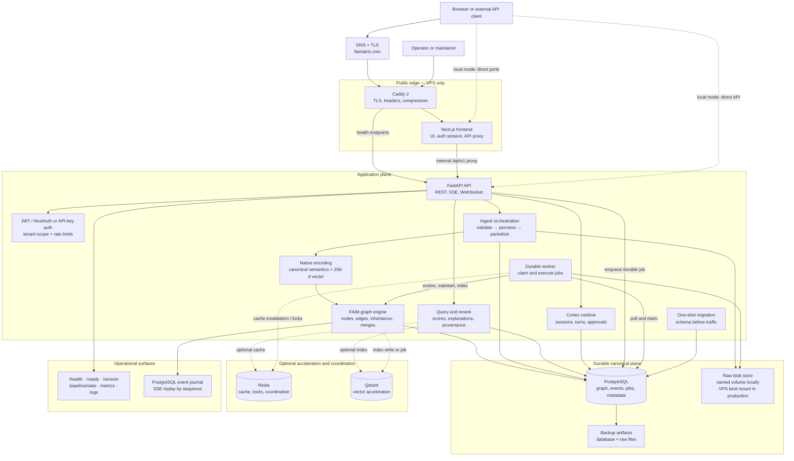
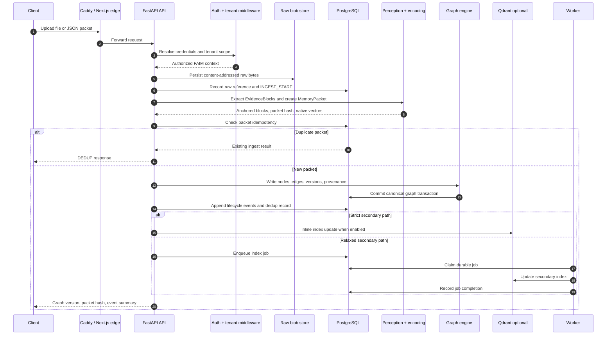
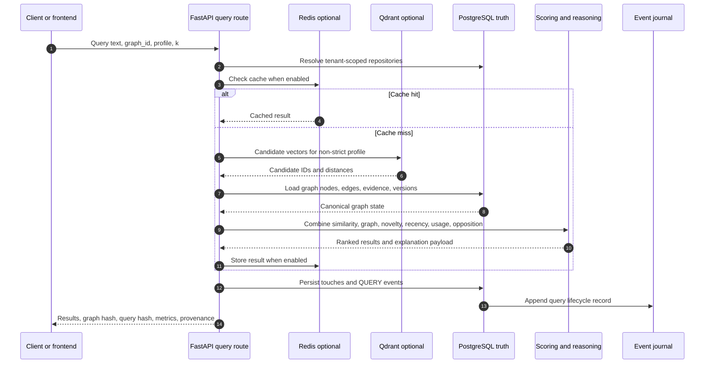
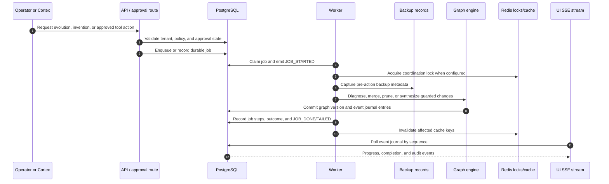
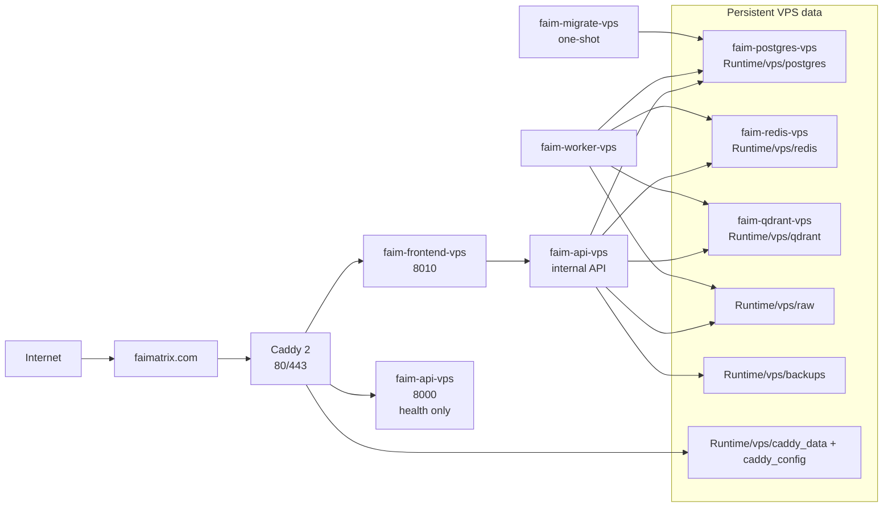

# FAIM-Native

<p align="center">
  <strong>Fractal Antisymmetric Inheritance Memory</strong><br />
  A deterministic, end-to-end memory graph engine for developers building retrieval, reasoning, and agent systems.
</p>

<p align="center">
  <em>Raw evidence → structured memory → graph evolution → explainable retrieval</em>
</p>


FAIM-Native is a research-oriented, native-first platform for turning documents, events, and multimodal evidence into a durable memory graph. It is a large-scope systems project under substantial active development, combining a FastAPI API, deterministic perception and encoding, graph-native operators, PostgreSQL persistence, optional retrieval acceleration, background jobs, and a Next.js workspace into one repository.

> **Project posture:** FAIM-Native is an actively evolving research and engineering system. Performance numbers, benchmark results, and production readiness should be established from the repository's benchmark and validation suites for the deployment being evaluated.

> **Experimental / unstable:** FAIM-Native is not a finished product. Many features, contracts, integrations, and operational procedures are still being developed, tested, or redesigned. Do **not** use it as the sole system of record for personal productivity, business-critical, production, safety-critical, regulated, or irreplaceable-data workloads. Evaluate it only in an isolated environment with disposable, synthetic, or safely backed-up data until a stable release and deployment-specific validation are published.

The project explores an alternative memory architecture in which raw evidence remains addressable, derived knowledge is represented as a versioned graph, retrieval includes graph context and explanations, and memory evolution is treated as a controlled lifecycle. This is a research direction and engineering hypothesis—not a claim of universal novelty, priority, or superiority over vector search, RAG, knowledge graphs, agent-memory systems, or any other approach. See [`RESEARCH_POSITIONING.md`](RESEARCH_POSITIONING.md) for the comparison and evaluation discipline.

See [`PROJECT_STATUS.md`](PROJECT_STATUS.md) for maturity, verification, and known documentation caveats.

## Why FAIM-Native

Most retrieval systems stop at “embed, search, return chunks.” FAIM-Native keeps the whole memory lifecycle visible:

- raw inputs are preserved as SHA-256-addressed blobs;
- extracted evidence keeps anchors and provenance;
- deterministic vectors and semantic representations become graph nodes;
- graph writes emit events and advance a graph version;
- retrieval returns scores, evidence, graph metrics, and optional explanations;
- evolution can diagnose redundancy, invent macro nodes, learn from outcomes, and restore from backups;
- the UI can observe the same graph, event stream, metrics, and Cortex workflow exposed by the API.

The result is a memory substrate designed for systems that need continuity, auditability, tenant isolation, and controlled evolution—not only a similarity endpoint.

## End-to-end system

The following is the current implemented topology, based on `docker-compose.yml`, `docker-compose.vps.yml`, `api/app.py`, `runtime/context.py`, the ingest/query flows, and the durable worker. It separates the public edge, application services, canonical data, and optional acceleration paths.



> **Accuracy boundary:** The current Compose stack does not deploy Kafka, Kubernetes, an external object store, Prometheus, a service mesh, or a mandatory hosted LLM. OCR and embedding-provider adapters exist as optional integration paths. PostgreSQL is the authoritative state; Redis and Qdrant are not independent sources of truth.

### The real lifecycle in plain language

1. **Reach the edge.** In VPS mode, DNS and Caddy terminate HTTPS. Caddy serves the Next.js frontend and routes health endpoints to FastAPI. In local mode, the frontend and API are reached directly on their mapped ports.
2. **Authenticate the request.** FastAPI middleware resolves a JWT/NextAuth session or API key, normalizes tenant scope, applies request IDs/rate limits/security headers, and passes a repository context to the route.
3. **Accept and preserve input.** Ingest validates JSON or multipart content, writes the raw payload to the raw store, records metadata/audit events in PostgreSQL, and computes a content/packet identity for idempotent retry handling.
4. **Perceive and encode.** The native extractor creates ordered `EvidenceBlock` records with anchors. Packet validation and canonicalization run before deterministic native encoding; optional OCR or embedding providers enrich the path when configured.
5. **Commit canonical graph state.** The graph engine writes nodes, edges, versions, provenance, and lifecycle events to PostgreSQL. This is the durable write boundary.
6. **Handle secondary acceleration.** Depending on profile and flags, Qdrant is updated inline, queued as a durable PostgreSQL job, or skipped. Redis may cache query results and coordinate locks; neither replaces PostgreSQL.
7. **Process background work.** The worker polls and claims rows from the PostgreSQL `jobs` table. It executes secondary indexing, evolution, invention, maintenance, retention, re-encryption, and related workflows, recording job events and outcomes.
8. **Query and explain.** Query reads canonical graph state, optionally consults Redis/Qdrant, calculates graph-aware scores, records touches/events, and returns ranked nodes with hashes, metrics, evidence anchors, and explanations.
9. **Stream state changes.** The SSE endpoint replays the PostgreSQL event journal by sequence number. The frontend can resume from its last sequence and receive progress, completion, job, and evolution events.
10. **Operate and recover.** Readiness checks database connectivity, required tables, and migration state. Operators use snapshots, backup/restore, audit events, logs, and smoke checks to validate or recover a deployment.

### Ingest sequence: request to durable memory



### Query and explanation sequence



### Evolution and control sequence



### Deployment topology



For the component inventory, failure behavior, local-versus-VPS differences, and known boundaries, see [`docs/END_TO_END_ARCHITECTURE.md`](docs/END_TO_END_ARCHITECTURE.md).

## Capabilities

### Native memory and retrieval

- deterministic text normalization, entity aliases, stemming, synonym expansion, and multilingual lexical tooling;
- fixed 256-dimensional `v_native` contract with SHA-256 vector hashes;
- graph nodes, edges, inheritance fractions, opposition signatures, versions, snapshots, and replayable events;
- strict, fast, and relaxed execution profiles where supported;
- query explain payloads with score components, evidence, parents, and recent events;
- representation V2, canonical semantics, multilingual semantics, modality sidecars, and domain knowledge surfaces.

### Durable ingestion and multimodal evidence

- JSON base64 ingestion and multipart upload ingestion;
- immutable raw storage with deduplication and provenance;
- PDF, DOCX, PPTX, XLSX, text, image, and related extraction paths represented in the core contracts;
- OCR provider registry with PaddleOCR, Tesseract, EasyOCR, and custom-provider integration points;
- durable upload jobs, cancellation, retry, re-ingestion, maintenance history, retention, and raw-file re-encryption flows.

### Evolution and agent workflows

- manual and guarded automated evolution controls;
- self-invention and macro-node proposals from coactivation evidence;
- evolution metrics, learning state, outcomes, theories, backups, and restore operations;
- FAIM Cortex turns, persisted sessions, WebSocket chat, tool-approval proposals, and explicit approve/reject controls;
- domain overview, graph surface, neighborhood, path explanation, and semantic graph inspection APIs.

### Operations and security

- PostgreSQL as the canonical source of truth;
- Redis-backed caching, locks, and durable job coordination;
- Qdrant-backed vector acceleration with native fallback paths;
- versioned migrations with readiness checks for database connectivity, required tables, and applied schema version;
- JWT/NextAuth integration and tenant-scoped API keys;
- scoped key management, rotation and revocation, audit events, rate limiting, request IDs, security headers, log redaction, encrypted raw storage, and container hardening;
- benchmark, stress, telemetry, backup/restore, and smoke-test tooling.

## Repository map

| Path | Responsibility |
| --- | --- |
| [`faim_native/api`](faim_native/api) | FastAPI application, routers, contracts, middleware, services, and validators |
| [`faim_native/core`](faim_native/core) | Graph engine, query scoring, reasoning, Cortex, operators, learning, and metrics |
| [`faim_native/perception`](faim_native/perception) | File extraction, OCR, packetization, and evidence validation |
| [`faim_native/encoding`](faim_native/encoding) | Native vectors, semantic signatures, layout, modality, and embedding-provider adapters |
| [`faim_native/lexical`](faim_native/lexical) | Unicode normalization, canonicalization, multilingual lexicons, aliases, and phrase patterns |
| [`faim_native/orchestration`](faim_native/orchestration) | Ingest/query/evolve flows, background jobs, rebuilds, and performance work |
| [`faim_native/store`](faim_native/store) | PostgreSQL repositories, migrations, raw blobs, crypto, journal, and persistence contracts |
| [`faim_native/index`](faim_native/index) | Qdrant index, deterministic ANN, inverted index, collections, and index wiring |
| [`faim_native/benchmarks`](faim_native/benchmarks) | Retrieval, persistence, continuity, efficiency, real-world task, and publication suites |
| [`frontend`](frontend) | Next.js dashboard, marketing/docs surfaces, authentication, graph views, and tests |
| [`scripts`](scripts) | Local demos, verification, smoke tests, backup/restore, deployment, and security automation |
| [`docs`](docs) | API, architecture, operations, security, benchmark, and implementation documentation |

## Quick start with Docker

### Prerequisites

- Docker Engine with Compose v2
- Node.js and npm for the root command wrapper
- Python 3.11 for local tests and scripts

### 1. Configure the stack

```bash
cp .env.example .env
```

Replace every `CHANGE_ME_*` value in `.env`. The default Compose stack expects secrets for PostgreSQL, Redis, Qdrant, and NextAuth. Keep `.env` local and never commit it.

### 2. Start the full stack

```bash
npm run faim:up
npm run faim:ps
```

The default Compose topology contains:

| Service | Local address | Role |
| --- | --- | --- |
| API | `http://localhost:8000` | FastAPI memory graph API |
| Frontend | `http://localhost:8010` | Next.js workspace and docs portal |
| PostgreSQL | `localhost:8020` | Canonical relational store with pgvector image |
| Redis | `localhost:8030` | Cache, locks, and job coordination |
| Qdrant | `localhost:8040` / gRPC `8050` | Vector acceleration |
| Worker | no public port | Polls PostgreSQL jobs and runs background workflows |
| Migrate | one-shot container | Applies explicit schema migrations before traffic |

The `migrate` service is a one-shot migration job. The API's `FAIM_AUTO_MIGRATE` default is intentionally `false`; use the explicit migration service or your deployment runbook so schema changes stay visible.

### 3. Verify liveness and readiness

```bash
curl -fsS http://localhost:8000/health
curl -fsS http://localhost:8000/ready
curl -fsS http://localhost:8000/version
```

Open these surfaces after the checks pass:

- API documentation: [`http://localhost:8000/docs`](http://localhost:8000/docs)
- ReDoc: [`http://localhost:8000/redoc`](http://localhost:8000/redoc)
- Frontend: [`http://localhost:8010`](http://localhost:8010)
- Frontend docs portal: [`http://localhost:8010/docs`](http://localhost:8010/docs)

### Useful lifecycle commands

```bash
npm run faim:logs       # Follow service logs
npm run faim:ps         # Show service state
npm run faim:down       # Stop the stack
npm run faim:update     # Fast-forward pull and rebuild
npm run faim:accel:up   # Start the acceleration profile when configured
```

## Run a real ingest and query

The protected API accepts either database-backed API keys or a compatible environment-key configuration. For a local integration shell, set credentials that match your `.env`:

```bash
export FAIM_TENANT_ID=default
export FAIM_API_KEY='replace-with-your-local-key'
export FAIM_GRAPH_ID='demo-graph'
```

Ingest a file:

```bash
curl -fsS -X POST http://localhost:8000/api/v1/ingest/upload \
  -H "X-Tenant-Id: ${FAIM_TENANT_ID}" \
  -H "X-Api-Key: ${FAIM_API_KEY}" \
  -F "graph_id=${FAIM_GRAPH_ID}" \
  -F "profile=strict" \
  -F "persist_mode=strict" \
  -F "file=@./sample.txt"
```

Query the graph:

```bash
curl -fsS -X POST http://localhost:8000/api/v1/query \
  -H "Content-Type: application/json" \
  -H "X-Tenant-Id: ${FAIM_TENANT_ID}" \
  -H "X-Api-Key: ${FAIM_API_KEY}" \
  -d '{
    "graph_id": "demo-graph",
    "query_text": "What should I remember from this document?",
    "k": 10,
    "profile": "STRICT",
    "return_explain": true
  }'
```

The response includes the graph version, query hash, ranked nodes, score components, evidence anchors, graph metrics, and optional direct-answer/provenance fields.

## API surface

The FastAPI app mounts the current versioned API under `/api/v1`.

| Area | Representative routes |
| --- | --- |
| Health | `GET /health`, `GET /ready`, `GET /version`, `GET /pipeline/stats` |
| Auth | `POST /api/v1/auth/otp/request`, `POST /api/v1/auth/otp/verify`, TOTP and account routes |
| Memory | `POST /api/v1/memory/search`, `POST /api/v1/memory/write`, memory lifecycle routes |
| Ingest | `POST /api/v1/ingest`, `POST /api/v1/ingest/upload` |
| Query | `POST /api/v1/query` |
| Graph | `/api/v1/graph/surface`, `/api/v1/graph/neighborhood`, `/api/v1/graph/paths/explain` |
| Nodes | `/api/v1/node/{node_id}`, `/api/v1/node/{node_id}/explain` |
| Events | `/api/v1/events`, `/api/v1/events/latest`, `/api/v1/events/stream` |
| Evolution | `/api/v1/evolve`, status, control, invention, backups, learning, and metrics |
| Storage | uploads, files, provenance, maintenance, retention, crypto rotation, and backend health |
| Cortex | turns, sessions, WebSocket chat, storage tools, and tool approvals |
| Benchmarks | benchmark runs, stress tests, alerts, golden signals, export, and publication suite |

For request and response contracts, start with [`FAIM_API_DOCUMENTATION.md`](<docs/2) BackEnd/API_Reference/FAIM_API_DOCUMENTATION.md>) and [`api_reference.md`](<docs/2) BackEnd/API_Reference/api_reference.md>). The generated OpenAPI document at `/openapi.json` is the runtime source of truth.

## Native design principles

| Principle | Meaning in FAIM-Native |
| --- | --- |
| Raw truth is immutable | Source bytes are content-addressed with SHA-256 and retained separately from derived graph state |
| PostgreSQL is canonical | Relational metadata, graph state, events, versions, and operational records have a durable source of truth |
| Evidence stays addressable | Blocks carry deterministic ordering and anchors back to their raw source |
| Determinism is explicit | Canonical JSON, stable hashes, fixed vector dimensions, and strict profiles make replay and comparison possible |
| Evolution is controlled | Guardrails, intervals, action limits, diagnostics, backups, and restore APIs bound automated change |
| Tenants are isolated | Auth context, repositories, graph reads, event streams, and storage paths carry tenant scope |
| Acceleration is secondary | Redis and Qdrant improve speed or coordination; the durable graph remains authoritative |
| Every mutation leaves a trail | Ingest, query, evolution, storage, approval, and diagnostics flows emit structured events or audit records |

## Configuration highlights

The main configuration surface is [`faim_native/runtime/config.py`](faim_native/runtime/config.py), with deployment examples in [`deploy`](deploy) and [`.env.example`](.env.example).

Important controls include:

- `DATABASE_URL`, `REDIS_URL`, `QDRANT_URL`, and `QDRANT_API_KEY` for data-plane services;
- `FAIM_AUTO_MIGRATE` for explicit migration behavior;
- `FAIM_ENABLE_CACHE`, `FAIM_ENABLE_INDEX`, and `FAIM_ENABLE_JOBS` for acceleration and background work;
- `FAIM_OCR_ENABLED`, `FAIM_OCR_ENGINE`, and `FAIM_OCR_FAIL_CLOSED` for OCR behavior;
- `FAIM_SELF_EVOLVE_ENABLED`, `FAIM_SELF_EVOLVE_TRIGGER_MODE`, and action/interval limits for evolution;
- `FAIM_SELF_INVENT_ENABLED` and invention thresholds for macro-node synthesis;
- `FAIM_ENCRYPTION_AT_REST`, `FAIM_ENCRYPTION_FAIL_CLOSED`, `FAIM_STORAGE_CONTRACT_STRICT`, and auth fallback switches for security posture;
- `FAIM_RATE_LIMITS_JSON`, payload limits, CORS, public origin, and CSP settings for edge behavior.

Production deployments should begin with the restrictive values in [`.env.example`](.env.example), then make every relaxation deliberate and documented.

## Local development and verification

Install Python dependencies, then run the repository test suite:

```bash
python3.11 -m venv .venv
source .venv/bin/activate
python -m pip install -r requirements.txt
pytest -q
```

Run the frontend checks from `frontend/`:

```bash
cd frontend
npm ci
npm run typecheck
npm run test:unit
npm run test:e2e
```

From the repository root, the convenience checks are:

```bash
npm run tsc
npm run eslint
npm run prettier
./scripts/security_audit.sh
```

Useful executable demos include:

```bash
python scripts/faim_write_demo.py ./sample.txt
python scripts/faim_diagnostics_demo.py
```

The acceptance suite covers tenant isolation, strict determinism, idempotent ingest, graph writes and merges, multihop recall, cross-lingual retrieval, multimodal reranking, storage lifecycle, Cortex, evolution, benchmarks, and security surfaces. Treat the output from the current checkout as the authoritative result; older reports in `docs/` describe historical stages and may contain superseded counts or commands.

## Deployment and operations

### Docker/VPS workflow

The repository includes a hardened multi-service Docker image and VPS helpers:

```bash
npm run faim:vps:sync
npm run faim:vps:up
npm run faim:vps:smoke
npm run faim:vps:backup
```

Stop or restore with care:

```bash
npm run faim:vps:down
npm run faim:vps:restore
```

Read [`docs/vps-production.md`](docs/vps-production.md), [`DEPLOYMENT.md`](<docs/2) BackEnd/Deployment_Ops/DEPLOYMENT.md>), and [`RUNBOOK.md`](<docs/2) BackEnd/Deployment_Ops/RUNBOOK.md>) before using a remote environment. The VPS scripts intentionally keep real environment files and backups outside normal source synchronization.

### Operational checks

```bash
curl -fsS https://your-host.example/health
curl -fsS https://your-host.example/ready
curl -fsS https://your-host.example/version
./scripts/security_audit.sh
```

Readiness is stronger than liveness: it checks database connectivity, required tables, and migration state. A service can be alive while remaining intentionally unready until schema and dependencies are correct.

## Documentation index

- [Project status](PROJECT_STATUS.md)
- [Experimental status and safe use](EXPERIMENTAL_STATUS.md)
- [Research positioning](RESEARCH_POSITIONING.md)
- [Roadmap and release gates](ROADMAP.md)
- [CI, semantic releases, and VPS deployment](CI_CD.md)
- [End-to-end architecture and runtime boundaries](docs/END_TO_END_ARCHITECTURE.md)
- [Security reporting policy](SECURITY.md)
- [Support guide](SUPPORT.md)
- [Contributing guide](CONTRIBUTING.md)
- [Governance](GOVERNANCE.md)
- [Code of conduct](CODE_OF_CONDUCT.md)
- [Changelog](CHANGELOG.md)
- [Backend overview](<docs/2) BackEnd/README.md>)
- [Architecture overview](docs/architecture_overview.md)
- [API documentation](<docs/2) BackEnd/API_Reference/FAIM_API_DOCUMENTATION.md>)
- [Core layer guide](<docs/2) BackEnd/API_Reference/core_layer_guide.md>)
- [Perception layer guide](<docs/2) BackEnd/API_Reference/perception_layer_guide.md>)
- [Encoding layer guide](<docs/2) BackEnd/API_Reference/encoding_layer_guide.md>)
- [Store layer guide](<docs/2) BackEnd/API_Reference/store_layer_guide.md>)
- [Full-stack workflow](<docs/2) BackEnd/Architecture/FULL_STACK_WORKFLOW.md>)
- [Request lifecycle](<docs/2) BackEnd/Architecture/REQUEST_LIFECYCLE.md>)
- [System wiring](<docs/2) BackEnd/Architecture/SYSTEM_WIRING.md>)
- [Security guide](<docs/2) BackEnd/Security/SECURITY_GUIDE.md>)
- [Threat model](<docs/2) BackEnd/Security/THREAT_MODEL.md>)
- [Multi-tenant isolation](<docs/2) BackEnd/Security/MULTI_TENANT_ISOLATION_GUARANTEE.md>)
- [Operations and deployment](docs/Operations/deployment.md)
- [Benchmark specification](docs/Benchmarks_Publication/BENCHMARK_SPEC.md)
- [Reproducibility kit](docs/Benchmarks_Publication/REPRODUCIBILITY_KIT.md)
- [Implementation report](docs/IMPLEMENTATION_REPORT.md)

## Contributing

Keep changes reviewable and preserve the native contracts. Before opening a pull request:

1. run the relevant Python and frontend tests;
2. run type, lint, formatting, and security checks that apply to the change;
3. update API or operational docs when a contract changes;
4. include migration, rollback, tenant-isolation, and provenance implications for persistence changes;
5. keep secrets, raw data, generated reports, and local runtime artifacts out of commits.

`main` is intended to remain protected; use a branch and pull request for changes.

## License

FAIM-Native source code, scripts, configuration, and code examples are licensed under the [Apache License 2.0](LICENSE).

Original documentation and non-code assets are licensed under [CC BY 4.0](LICENSE-DOCS.md). Third-party dependencies, container images, datasets, model weights, provider integrations, and user content remain under their own terms; see [`THIRD_PARTY_NOTICES.md`](THIRD_PARTY_NOTICES.md).

FAIM, FAIM-Native, FAIMATRIX, and project logos are not granted as trademarks by the software license. See [`TRADEMARKS.md`](TRADEMARKS.md).

See [`CONTRIBUTING.md`](CONTRIBUTING.md) for contribution and submission terms. This licensing setup should be reviewed by the project copyright holder or legal counsel before a public commercial launch.
