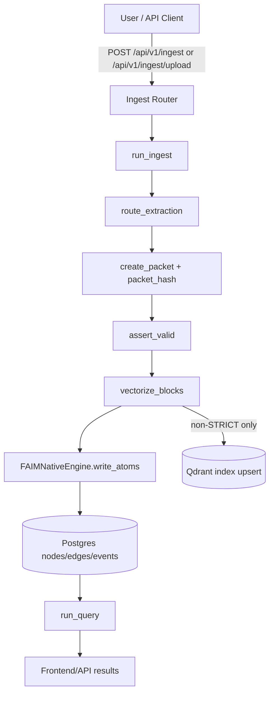
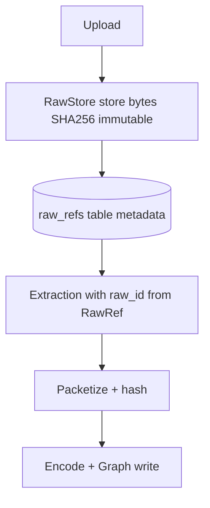
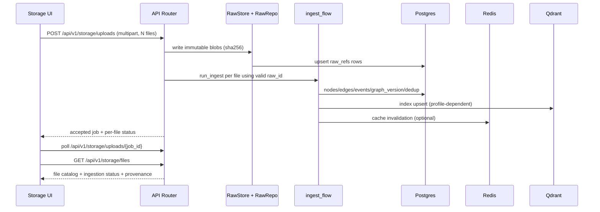

# 02 - Storage Upload to AI Dataflow Report

Date: 2026-02-11
Owner: FAIM Native Runtime
Status: Completed

## Objective

Document the implemented upload-to-retrieval path, including raw-store provenance and bounded retrieval behavior.

This document describes the end-to-end data path.

## A. Current Flow (as implemented)

### Step Details (Current)

1. Upload arrives in ingest router.
- JSON base64 or multipart upload.

2. File bytes are extracted to `EvidenceBlock` objects.
- Doc-type route from extension map.
- OCR/image path currently stub-oriented.

3. Memory packet is created.
- deterministic sort by anchor
- `packet_hash` computed from canonical representation

4. Blocks + packet are validated.
- anchor validity
- confidence ranges
- ordering/hash consistency

5. Blocks are encoded to fixed 256-dim `FAIMVector`.
- deterministic hashed n-gram + stats method

6. Engine writes graph atoms.
- upsert node by `vector_hash`
- inheritance edges
- antisym merge/opposition edges
- graph version bump

7. Optional index write.
- in non-STRICT profile only (acceleration path)

8. Query and retrieval.
- query text vectorized with same deterministic encoder
- candidates recalled with cache/index acceleration when available, deterministic fallback path always available
- FAIM score components applied
- response returns node/evidence metadata

## B. Raw File Persistence Link (Implemented)

Raw immutable storage is now wired before extraction in ingest/storage API paths.

Implemented path:

This link is active and supports runtime provenance via `raw_id` and `raw_refs`.

## C. Current Production Flow (Implemented)

## D. Retrieval Flow to AI/Agents

### Query Retrieval

1. query text is encoded with same deterministic vectorizer used for ingest.
2. candidate nodes are recalled.
3. FAIM score combines:
- similarity
- novelty residual
- opposition penalty
- redundancy penalty
- recency and usage boosts
- level penalty
4. top-k results include evidence metadata (`raw_id`, `block_id`, `anchor`).

### Agent Consumption

AI/agent consumers should use:

- node summary for ranking
- explain payload for provenance
- raw reference lookup for original immutable source when needed

## E. Multi-file Upload Behavior (implemented)

For storage page and backend API, each file must follow independent status transitions:

- `queued`
- `raw_stored`
- `extracting`
- `encoding`
- `graph_written`
- `indexed` (optional)
- `completed` or `failed`

Batch supports partial success without losing successful file writes.

Current implementation notes:

- Storage UI runs per-file queue state machine and tracks individual job/event timelines.
- Upload jobs support cancellation and retry paths.
- Observability includes failure taxonomy, dedup ratio, and ingest phase latency aggregates.
