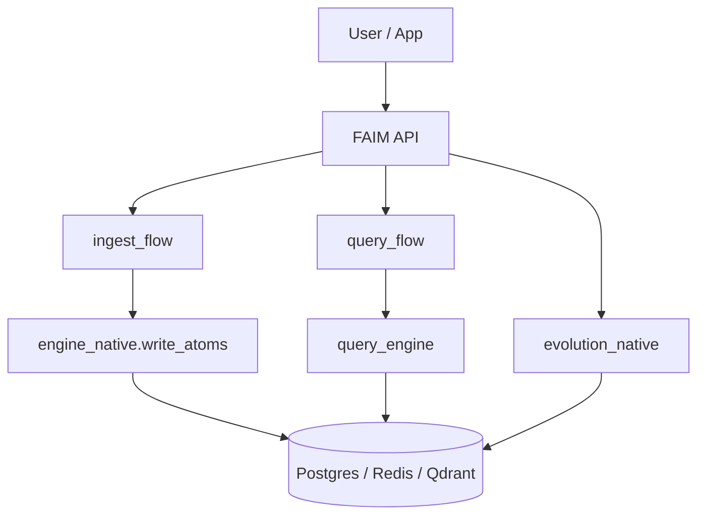
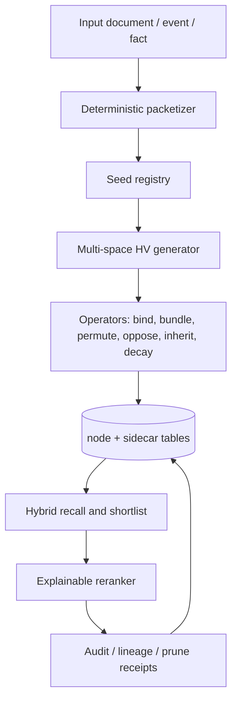
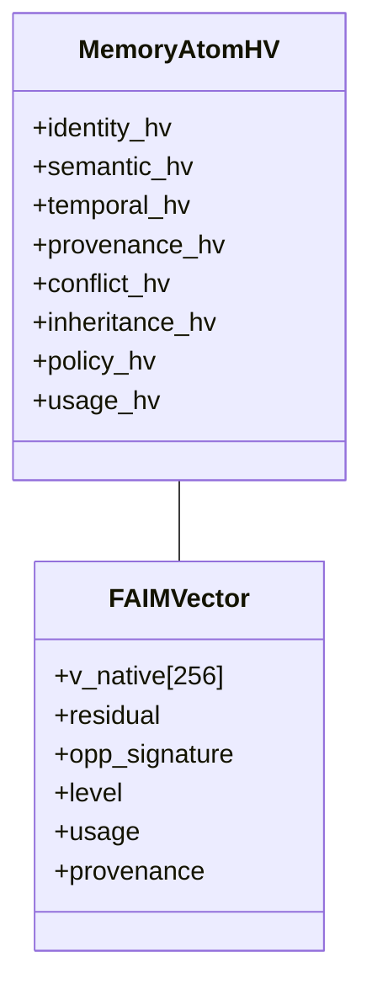

# FAIM-MHVC: FAIM MultiSpace HyperVector Computation

Status: research and implementation blueprint
Scope: additive FAIM-native hypervector layer, no breakage of the existing FAIM baseline

## Abstract

FAIM already implements a deterministic memory graph engine with a fixed 256-d native vector, additive lexical-semantic sidecars, inheritance, antisymmetric merge/cancel, graph semantics, evolution diagnostics, and explainable query scoring. This document proposes a new layer on top of that baseline: FAIM-MHVC, short for FAIM MultiSpace HyperVector Computation.

The novelty is not "HDC but larger." The novelty is a typed, deterministic, multi-space hypervector memory substrate for temporal truth, conflict handling, inheritance, pruning, and explainable recall. The design keeps the existing FAIM baseline intact and adds an opt-in premium layer that can be benchmarked against classical HDC/VSA baselines under identical datasets, metrics, and compute budgets.

This paper is intentionally evidence-based. Implemented claims refer only to code already present in this repository. Proposed claims are clearly marked as proposed. No benchmark numbers are fabricated here.

## Naming Decision

Recommended primary name: `FAIM-MHVC`

Recommended engineering shorthand: `FAIM-HV`

Meaning:
- `FAIM` preserves the research identity of the existing system.
- `MHVC` makes the research contribution explicit: MultiSpace HyperVector Computation.
- `HV` is easier for product UI, config flags, and enterprise mode labels.

Why not call the whole system HDC:
- HDC/VSA already names the field of high-dimensional distributed representations, binding, bundling, permutation, and associative memory.
- FAIM is not trying to relabel itself as HDC; it is extending FAIM-native memory governance with HDC-like capacities.
- The public story is stronger when the system name stays FAIM and the new layer is named as a FAIM-native hypervector extension.

## 1. What Already Exists in FAIM

The current codebase already gives FAIM a strong deterministic backbone:

| Area | Implemented evidence | What it does today |
| --- | --- | --- |
| Native vector contract | `faim_native/encoding/vector_schema.py` | Fixed-dimension `v_native` at 256 dims, deterministic hash, immutable node vector schema |
| Native encoding | `faim_native/encoding/text_vectorizer.py` | Deterministic hashed n-gram encoding with alias expansion, stemming hooks, and numeric stats |
| Additive sparse sidecar | `faim_native/encoding/representation_v2.py` | Word/phrase/skip/entity/time/layout channels without changing the 256-d native contract |
| Storage for sidecar | `faim_native/store/pg/models_faim.py`, `faim_native/store/pg/migrations/0012_representation_v2.sql` | Node-level sidecar rows keyed by `node_id`, `tenant_id`, and `graph_id` |
| Write path | `faim_native/core/engine_native.py` | Ingest writes nodes, inheritance edges, semantic edges, opposition edges, and graph version events |
| Inheritance math | `faim_native/core/operators/inheritance.py` | Parent selection, fraction normalization, residual computation, deterministic tie-breaking |
| Antisymmetry | `faim_native/core/antisym.py` | Similarity-driven merge/cancel with deterministic winner selection |
| Semantic typing | `faim_native/core/operators/semantic_typing.py` | Synonym/hypernym/hyponym/related classification and semantic edge weights |
| Query flow | `faim_native/orchestration/query_flow.py` | Canonicalization, IDF weighting, inheritance expansion, graph semantics, Representation V2 fusion, cache/index fallback |
| Query scoring | `faim_native/core/query/query_engine.py` | Multi-signal rerank using similarity, novelty, opposition, redundancy, recency, usage, and level penalties |
| Graph semantics | `faim_native/core/query/graph_semantics.py` | Bounded multi-hop diffusion and contradiction-aware traversal |
| Evolution | `faim_native/core/dynamics/evolution_native.py` | Diagnostics-driven merge/prune adaptation and self-invention hooks |

The important point is that FAIM is already more than a flat vector search layer. The new layer should formalize and expand that direction rather than replacing it.

## 1.1 Repo-Wide Coverage Map

This paper covers the full FAIM system at the level that matters for a research and implementation blueprint. It is not a line-by-line source code audit, but it does map the major production surfaces that the new layer must respect.

| Surface | Exact paths | Why it matters for FAIM-MHVC |
| --- | --- | --- |
| API and middleware | `faim_native/api/app.py`, `faim_native/api/middleware/{security.py,jwt.py,auth.py,ratelimit.py,request_id.py,session.py,errors.py}`, `faim_native/api/routers/{ingest.py,query.py,evolve.py,memory.py,graph.py,storage.py,auth.py,api_keys.py,admin.py,benchmarks.py,metrics.py,events.py,health.py,faim_bench.py}` | Public contract, auth, tenant isolation, rate limits, logging, and route stability. MHVC must enter through profile/flag selection, not by changing the contract. |
| Perception and ingestion | `faim_native/perception/{router.py,packetize.py,validate.py,extract/*}` | Input validation, packetization, OCR/extraction, and block assembly. This is where a new packet layer can be attached without altering the baseline node contract. |
| Encoding and lexical semantics | `faim_native/encoding/*`, `faim_native/lexical/*` | Deterministic native vectors, Representation V2 sidecars, canonicalization, multilingual normalization, synonym expansion, and the first place a hypervector packet can reuse existing deterministic transforms. |
| Core memory math | `faim_native/core/{engine.py,engine_native.py,antisym.py,invariants.py,operators/*,query/*,dynamics/*}` | The core math boundary for inheritance, opposition, semantic typing, scoring, graph traversal, and evolution. MHVC operators should be added here first, then wired outward. |
| Storage, cache, indexes, and raw data | `faim_native/store/*`, `faim_native/cache/*`, `faim_native/index/*`, `faim_native/orchestration/perf/*` | Persistent node data, sidecar tables, journals, raw blobs, query cache, ANN/shortlist support, and performance acceleration. |
| Jobs and orchestration | `faim_native/orchestration/{ingest_flow.py,query_flow.py,evolve_flow.py,profile_persist_policy.py,self_evolve_scheduler.py,jobs/*}` | Runtime routing, durable execution, feature-flag selection, and safe rollout boundaries for the new layer. |
| Benchmarks and tests | `faim_native/benchmarks/*`, `tests/unit/*`, `tests/acceptance/*`, `tests/security/*` | Non-regression, determinism, latency, and publication-grade comparison gates. |
| Frontend and product UI | `frontend/src/app/*`, `frontend/src/components/*`, `frontend/e2e/*` | Baseline vs premium toggle, enterprise visibility, control plane, and user-facing explanation of the new layer. |
| Docs and operations | `faim_native/Docs/*`, `docs/Benchmarks_Publication/*`, `docs/Operations/*`, `docs/2) BackEnd/*` | Source of truth for rollout, operations, benchmark rules, and publication reporting. |

## 2. Related Work Positioning

HDC/VSA already covers high-dimensional distributed representations and algebraic operators such as binding, bundling, and permutation. The survey literature explicitly frames HDC/VSA as a family of models built around these operations. VSA literature also highlights high-dimensional vector processing as a computational framework and notes rule-of-thumb dimensions often above 1000.

What that means for FAIM:
- HDC gives the algebraic inspiration.
- FAIM-MHVC must contribute the memory-governance layer: typed packets, current-vs-historical truth, contradiction handling, inheritance compression, auditable pruning, and explainable recall.
- The research novelty is not raw dimension count alone.

Use HDC/VSA as the external comparison class, not the identity of the system.

## 3. Research Hypothesis

FAIM-MHVC hypothesis:

> If a deterministic memory engine represents each memory atom as a typed packet of coordinated hypervector spaces, and if those spaces are tied to explicit operators for inheritance, conflict, temporal truth, provenance, policy, and usage, then the system can improve retrieval robustness, explanation quality, and lifecycle control without introducing ML dependencies or breaking the existing FAIM baseline.

This hypothesis is testable.

## 4. Proposed Layer

### 4.1 Core idea

Classic HDC/VSA often represents one object as one hypervector, or as a composition of vectors using binding and bundling.

FAIM-MHVC represents one memory atom as a typed packet:

```text
MemoryAtomHV =
{
  identity_hv,
  semantic_hv,
  temporal_hv,
  provenance_hv,
  conflict_hv,
  inheritance_hv,
  policy_hv,
  usage_hv
}
```

The first implementation should be conservative:
- keep the current `v_native` 256-d path unchanged
- add only a new optional layer
- begin with four spaces: semantic, temporal, provenance, conflict
- expand to identity, inheritance, policy, and usage only after benchmark evidence

### 4.2 Recommended starting dimensional plan

Do not replace the existing 256-d path in place.

Recommended first-stage capacity plan:
- baseline compatibility vector: `v_native = 256`
- FAIM-MHVC packet: 4 spaces x 512 dims, or an equivalent sparse/binary bipolar representation with similar effective capacity
- later expansion: 8 spaces only if benchmarks show value

Reason:
- 256-d baseline is already wired through the codebase
- a direct jump to dense 4096/8192/10000 float vectors would ripple through storage, query scoring, tests, and latency
- a multi-space packet gives more control over noise and explainability than simply making the vector larger

### 4.3 Spaces

Initial spaces:

| Space | Purpose | Typical source in FAIM |
| --- | --- | --- |
| Semantic | Meaning, topic, concept overlap | `text_vectorizer`, `representation_v2`, semantic edges |
| Temporal | Current vs historical truth, recency, event order | `last_access`, `created_at`, `events`, evolution state |
| Provenance | Source, raw file, anchor, extractor, confidence | `RawRef`, `EvidenceBlock`, `anchor`, `provenance` |
| Conflict | Opposition, contradiction, dominance, suppression | `antisym`, opposition edges, contradiction notes |

Later spaces:
- Identity
- Inheritance
- Policy
- Usage
- Modality

## 5. Operators and Invariants

The new layer should define explicit deterministic operators.

### 5.1 Binding

Purpose:
- attach role to value
- encode structured facts

Suggested form:

```text
bind(role_hv, value_hv) -> bound_hv
```

Implementation options:
- bipolar componentwise multiply
- XOR-style binding for binary vectors
- deterministic circular convolution if a float-space operator is preferred

### 5.2 Bundling

Purpose:
- aggregate multiple evidence items into one packet

```text
bundle({h_i}, weights) = normalize(sum_i w_i * h_i)
```

Invariant:
- bounded norm
- deterministic order
- stable tie-breaking

### 5.3 Permutation

Purpose:
- encode sequence and position

```text
permute(h, k) = deterministic shift / permutation / roll
```

Invariant:
- same seed and same `k` give the same output

### 5.4 Antisymmetry / Opposition

Purpose:
- express contradiction without blind overwrite

```text
oppose(old_hv, new_hv) -> conflict_hv
```

Expected behavior:
- preserve historical truth
- prefer current truth when source/time/confidence wins
- never lose the audit trail

### 5.5 Inheritance

Purpose:
- compress related memories into lineage trees

```text
child_hv = alpha * parent_mix + residual
```

Required invariants:
- parent fractions sum to 1
- residual stays bounded
- deterministic parent ordering

### 5.6 Decay, sleep, revive

Purpose:
- model memory lifecycle instead of flat retention

Proposed semantics:
- decay reduces access weight
- sleep preserves compressed trace
- revive restores a memory when query evidence or policy requires it

### 5.7 Core invariants

The paper should formalize these invariants:
- determinism
- tenant isolation
- bounded norm per space
- stable tie-breaking
- fraction sum normalization
- merge idempotence
- prune safety
- event-order reproducibility
- no cross-graph leakage

## 6. How FAIM-MHVC Differs From Plain HDC

Plain HDC/VSA strengths:
- high-dimensional distributed representation
- binding, bundling, permutation
- robust similarity under noise
- hardware-friendly vector algebra

FAIM-MHVC additions:
- typed packet of spaces instead of one flat vector
- current-vs-historical truth separation
- contradiction as a first-class operator
- inheritance and residual compression
- auditable pruning with lineage
- explainable retrieval reasons by space
- deterministic graph lifecycle integration

This is the novelty line.

## 7. Architecture

### 7.1 Baseline FAIM pipeline



### 7.2 Proposed FAIM-MHVC layer



### 7.3 Memory atom packet



The class diagram above is conceptual. The actual implementation should remain backward compatible with the current `FAIMVector` contract and add packet data as a sidecar.

## 8. Compatibility Strategy

The new layer must not create duplicate graphs or a second identity universe.

Rules:
- same `tenant_id`
- same `graph_id`
- same `node_id`
- same event journal
- same auth and tenant enforcement
- same baseline routes

The data model should stay one node, multiple representations:
- current FAIM native vector
- current Representation V2 lexical-semantic sidecar
- new FAIM-MHVC packet sidecar

That means "dual-write" does not mean duplicate memory. It means one memory atom stored in more than one representation keyed by the same node identity.

## 9. Current Files That Anchor the Future Layer

These are the files that already provide the attachment points:

- `faim_native/encoding/vector_schema.py`
- `faim_native/encoding/text_vectorizer.py`
- `faim_native/encoding/representation_v2.py`
- `faim_native/core/engine_native.py`
- `faim_native/core/operators/inheritance.py`
- `faim_native/core/antisym.py`
- `faim_native/core/operators/semantic_typing.py`
- `faim_native/core/query/query_engine.py`
- `faim_native/core/query/graph_semantics.py`
- `faim_native/core/dynamics/evolution_native.py`
- `faim_native/orchestration/ingest_flow.py`
- `faim_native/orchestration/query_flow.py`
- `faim_native/store/pg/models_faim.py`
- `faim_native/store/pg/migrations/0012_representation_v2.sql`
- `faim_native/store/pg/repos/representation_repo.py`

Suggested new files for the future layer:

- `faim_native/hv/__init__.py`
- `faim_native/hv/schema.py`
- `faim_native/hv/generator.py`
- `faim_native/hv/operators.py`
- `faim_native/hv/recall.py`
- `faim_native/hv/compat.py`
- `faim_native/store/pg/migrations/0023_hv_packet.sql`
- `faim_native/store/pg/models_hv.py`
- `tests/unit/test_hv_packet.py`
- `tests/unit/test_hv_operators.py`
- `tests/unit/test_hv_recall.py`
- `tests/acceptance/test_AT_HV_profile_switch.py`
- `tests/acceptance/test_AT_HV_no_regression.py`

Suggested frontend touchpoints for enterprise toggle:

- `frontend/src/app/(app)/dashboard/profile/page.tsx`

## 10. API and Route Boundary

Phase 1 should avoid new public routes if possible.

Preferred approach:
- keep `api/routers/ingest.py`, `query.py`, `evolve.py`, `memory.py`, and `graph.py` stable
- expose the new layer through profile or feature-flag selection
- keep current response shapes unchanged

If a new control-plane endpoint is ever needed, it should be administrative only and not part of the public query/ingest contract.

## 11. Safe Implementation Sequence

### Phase 1: Research-scoped packet layer

What to do:
- define packet schema
- define deterministic seed derivation
- define space registry
- define bind/bundle/permute/oppose helpers

Why:
- this creates the research substrate without touching the baseline engine

### Phase 2: Storage and repository support

What to do:
- add sidecar table for packet data keyed by `node_id`
- add repository for insert/update/read
- keep baseline `FAIMVector` untouched

Why:
- one node, multiple representations

### Phase 3: Query integration

What to do:
- add a feature-flagged recall path that can score packet spaces
- keep old path as fallback

Why:
- lets enterprise users opt in without breaking normal users

### Phase 4: Evolution integration

What to do:
- feed packet diagnostics into evolution only after the layer is stable

Why:
- keep merge/prune safety under control

### Phase 5: Benchmarking

What to do:
- compare baseline FAIM vs FAIM-MHVC
- compare FAIM-MHVC vs external HDC/VSA baselines

Why:
- this is the only defensible way to claim improvement

## 12. Benchmark Protocol

This paper should not invent results. It should specify the protocol.

Use the existing benchmark framework in `faim_native/benchmarks/` and extend it with FAIM-MHVC-specific tasks:

### Public benchmark tracks

- retrieval accuracy
- efficiency and latency
- deterministic replay

### Memory-specific tracks

- current truth resolution
- historical truth retrieval
- contradiction suppression
- inheritance compression
- pruning audit fidelity
- explanation completeness

### Required metrics

- Recall@k
- nDCG@k
- MRR
- MAP
- latency p50/p95
- memory footprint
- deterministic replay hash match
- conflict resolution accuracy
- duplicate suppression rate

### Required baseline comparison

- baseline FAIM
- FAIM-MHVC
- classical HDC/VSA baseline

Use the same dataset, same k, same compute budget, same seed, and same metric implementation.

## 13. What Must Not Break

The new layer must preserve all of the following:

- current default behavior
- tenant isolation
- auth and API key enforcement
- encryption and cryptography paths
- event ordering and journal semantics
- graph versioning
- ingest idempotency
- query determinism
- frontend response shapes
- production jobs and storage workflows
- existing acceptance and unit tests

The existing system should remain the default.

## 14. What This Paper Can Claim

Safe claims:
- FAIM already has a deterministic native vector core plus additive lexical-semantic sidecars.
- FAIM already implements inheritance, antisymmetry, semantic typing, graph traversal, and evolution diagnostics.
- FAIM-MHVC is a proposed additive layer that makes those axes explicit as typed hypervector spaces.
- The right novelty is governed memory computation, not just larger vectors.

Unsafe claims until benchmarks run:
- beating every HDC system on every task
- beating all transformer embeddings universally
- faster than all GPU-optimized HDC implementations
- zero-noise recall

## 15. Open Questions

- Which spaces should be enabled in phase 1: four spaces or six?
- What is the best encoding format: bipolar float, binary, or sparse signed vectors?
- Should the packet layer be stored in one table or several per-space tables?
- Should enterprise mode be selected by profile, tenant policy, or both?
- Which benchmark track should be the first publication target?

## 16. Conclusion

FAIM-MHVC is the most defensible next step if the goal is to make FAIM more powerful without damaging the existing system. It keeps the current FAIM baseline intact, adds a new typed hypervector layer, and moves the research novelty away from "bigger vectors" toward governed memory computation.

The best overall positioning is:

> FAIM-MHVC is a deterministic typed hypervector memory layer for current and historical truth, conflict handling, inheritance compression, pruning governance, and explainable recall.

That is a real FAIM contribution, not a relabeled HDC clone.

## References

External references:

1. Kleyko, D. et al. "A Survey on Hyperdimensional Computing aka Vector Symbolic Architectures, Part I: Models and Data Transformations." ACM Computing Surveys, 2022. HDC/VSA survey and model taxonomy.
2. Neubert, P. and Schubert, S. "Hyperdimensional computing as a framework for systematic aggregation of image descriptors." arXiv:2101.07720.
3. "Vector Symbolic Architectures as a Computing Framework for Emerging Hardware." Redwood / Berkeley technical overview of VSA/HDC operations and hardware mapping.

Internal code evidence:

- `faim_native/encoding/vector_schema.py`
- `faim_native/encoding/text_vectorizer.py`
- `faim_native/encoding/representation_v2.py`
- `faim_native/core/engine_native.py`
- `faim_native/core/operators/inheritance.py`
- `faim_native/core/antisym.py`
- `faim_native/core/operators/semantic_typing.py`
- `faim_native/core/query/query_engine.py`
- `faim_native/core/query/graph_semantics.py`
- `faim_native/core/dynamics/evolution_native.py`
- `faim_native/orchestration/ingest_flow.py`
- `faim_native/orchestration/query_flow.py`
- `faim_native/store/pg/models_faim.py`
- `faim_native/store/pg/migrations/0012_representation_v2.sql`
- `faim_native/store/pg/repos/representation_repo.py`
