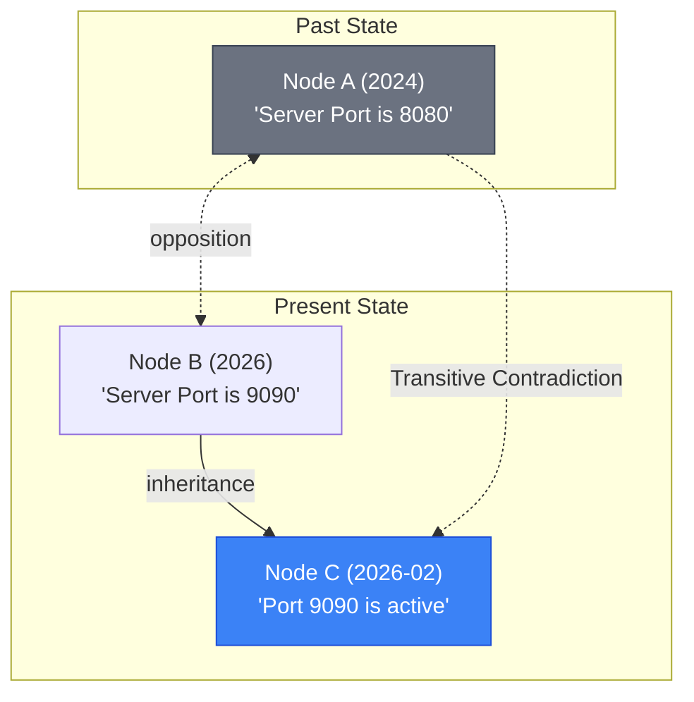

# 79. FAIM Advanced Temporal Contradiction Resolution

This document describes the design, mathematical model, and configuration of the **Advanced Temporal Contradiction Resolution** engine implemented inside the Fractal Antisymmetric Inheritance Memory (FAIM).

---

## 1. Problem Statement & Legacy Architecture

In cognitive memory graphs, factual knowledge is non-stationary: real-world facts change over time. When a query is run, two or more retrieved memory fragments may convey logically opposing information.

### The Legacy Solution (1-hop Hard Suppression)
Previously, FAIM supported basic **1-hop binary suppression**:
1. Check for immediate `opposition` edges directly between the retrieved candidates.
2. Compare the creation timestamps of the opposing nodes.
3. Mark the newer node as `CURRENT` and the older as `HISTORICAL`.
4. Delete the historical node entirely from the final query results.

### The Limitations:
* **No Transitivity**: If node $C$ inherits from $B$, and $B$ is in opposition with $A$, the old system could not detect that $C$ is in conflict with $A$.
* **Information Loss**: Deleting older historical nodes from the results prevents downstream clients from understanding *why* a fact changed or tracking the timeline of updates.
* **No Lineage Tracing**: Clients received no structured references linking the outdated fact to its successor.

---

## 2. Advanced Transitive Contradiction Model

The upgraded architecture introduces **Transitive Contradiction Traversal (TCT)** and **Configurable Soft Suppression** with **Lineage Linking**.



### 2.1 Transitive Contradiction Traversal (TCT)
Let $C = \{c_1, c_2, \dots, c_k\}$ be the set of retrieved candidate memory nodes.
For each candidate $c_i$, we define its inheritance ancestry up to 2-hops:

$$\text{Ancestors}(c_i) = \{c_i\} \cup \text{Parents}(c_i) \cup \text{Parents}(\text{Parents}(c_i))$$

A contradiction exists between candidate $c_i$ and $c_j$ ($i \neq j$) if there exists an ancestor of $c_i$ that is connected to an ancestor of $c_j$ via an `opposition` edge:

$$\exists a \in \text{Ancestors}(c_i), b \in \text{Ancestors}(c_j) \quad \text{such that} \quad (a, b) \in E_{\text{opposition}}$$

This allows children representing specific context or downstream assertions to inherit the parent's opposition boundaries, resolving complex contradiction matrices.

### 2.2 Resolution & Lineage Assignment
When a contradiction between $c_i$ and $c_j$ is discovered:
1. Retrieve their creation timestamps $t_i$ and $t_j$.
2. The node with the larger timestamp ($t_{\text{new}} \geq t_{\text{old}}$) is designated as `CURRENT`.
3. The node with the smaller timestamp is designated as `HISTORICAL`.
4. Link the two nodes:
   * $c_{\text{old}}.\text{superseded\_by} = c_{\text{new}}$
   * $c_{\text{new}}.\text{supersedes} \leftarrow c_{\text{new}}.\text{supersedes} \cup \{c_{\text{old}}\}$

---

## 3. Configuration & API Surface

FAIM exposes a new query request field `include_historical` (boolean) to control how contradiction resolution handles historical facts.

### 3.1 Hard Suppression (`include_historical = False`)
Older, superseded nodes are **filtered out** of the returned list, ensuring the query returns only the most up-to-date, current state of knowledge. Use this for deterministic, clean, factual RAG pipelines.

### 3.2 Soft Suppression (`include_historical = True` - Default)
Older nodes are **kept** in the results list but annotated with their temporal status. This allows frontends, dashboards, and agentic narrators to reconstruct the full evolutionary history of a memory block:

```json
{
  "node_id": "8e36e651-7cc7-48f8-80f4-52d3a9bb7e93",
  "vector_hash": "hash_a",
  "score": 0.82,
  "temporal_status": "HISTORICAL",
  "supersedes": [],
  "superseded_by": "f3bfa31b-7a32-45e0-822e-c7cb63e144a2"
}
```

---

## 4. Architectural Verification

The advanced temporal engine is verified by comprehensive unit tests inside [`test_transitive_contradiction.py`](file:///home/sephi-asi/FAIM/tests/unit/test_transitive_contradiction.py):
1. **Transitive Traversal**: Successfully flags node $A$ (old) as contradicted by node $C$ (new) via the inheritance chain $C \to B$ and opposition $B \leftrightarrow A$.
2. **Soft Suppression Verification**: Proves both nodes are returned, properly labeled, and cross-referenced.
3. **Hard Suppression Verification**: Proves Node $A$ is successfully omitted from the output when `include_historical=False`.
