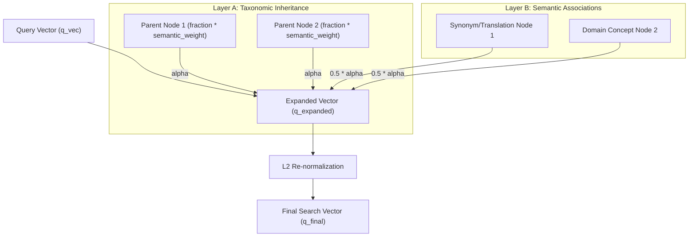

# 80. FAIM Inheritance-Weighted Query Expansion (IWQE)

This document details the mathematical formulations, architectural design, and codebase implementation of the **Inheritance-Weighted Query Expansion (IWQE)** engine inside the Fractal Antisymmetric Inheritance Memory (FAIM).

---

## 1. Core Motivation & Problem Statement

In classic vector search systems, queries are matched purely against raw document embeddings. However, this approach misses crucial structural and semantic relationships present in cognitive graphs:
* **Taxonomic Hierarchy**: If a query references a highly specific concept, it inherits meaning and vocabulary from parent categories (e.g. *Berlin* inherits context from *Germany* and *Europe*).
* **Semantic Associations**: Concepts are surrounded by synonyms, translations, and domain specific associations that might not be explicitly contained in the original query string.

To resolve these limitations, FAIM implements **IWQE**—a dynamic query reformulation mechanism that runs *on retrieval* and rewrites the query vector in 256-dimensional space, blending taxonomic ancestry and semantic neighbors before final scoring.

---

## 2. Mathematical Formulation

Let $\vec{q} \in \mathbb{R}^{256}$ be the initial query vector generated from the user's raw text. The expansion blends two primary graph layers to produce an enriched query vector $\vec{q}_{\text{expanded}}$:



### 2.1 Layer A: Taxonomic Inheritance Blending
For each of the seed nodes retrieved by the initial vector search, we identify their parent nodes connected via `inheritance` edges. The contribution of these parent vectors is accumulated and scaled:

$$\vec{q}_{\text{expanded}} \leftarrow \vec{q} + \sum_{p \in \text{Parents}} \alpha \cdot \text{fraction}_{p} \cdot \text{semantic\_weight}_{p} \cdot \vec{v}_{p}$$

Where:
* $\alpha$: Global inheritance blending strength (defaults to `0.2` in production).
* $\text{fraction}_{p}$: The edge weight (stored as double precision divided by $10^9$, representing how strongly the child inherits from the parent).
* $\text{semantic\_weight}_{p}$: Extracted dynamically from edge metadata (defaults to `1.0`), representing the specific importance of that taxonomic relationship.
* $\vec{v}_{p}$: The 256-dimensional vector representing the parent node.

### 2.2 Layer B: Semantic Association Blending
We also traverse semantic relationship edges connected to seed nodes (such as synonyms, translations, domain terms). These neighbor vectors are blended using a halved blending strength parameter to maintain taxonomic dominance:

$$\vec{q}_{\text{expanded}} \leftarrow \vec{q}_{\text{expanded}} + \sum_{n \in \text{Neighbors}} \alpha_{\text{semantic}} \cdot \text{semantic\_strength}_{n} \cdot \vec{v}_{n}$$

Where:
* $\alpha_{\text{semantic}} = 0.5 \cdot \alpha$: Scaled semantic blending parameter.
* $\text{semantic\_strength}_{n}$: The semantic confidence score of the edge relationship (stored weight divided by $10^9$).

### 2.3 L2 Normalization Lock
To keep the search space clean and ensure cosine similarity metrics are exact, we re-normalize the final vector to unit length:

$$\vec{q}_{\text{final}} = \frac{\vec{q}_{\text{expanded}}}{||\vec{q}_{\text{expanded}}||_2}$$

---

## 3. Core Implementation Walkthrough

The IWQE pipeline is written directly inside [`faim_native/core/query/query_engine.py`](file:///home/sephi-asi/FAIM/faim_native/core/query/query_engine.py#L573) in the `inheritance_weighted_expansion` function.

### 3.1 Code Signature & Loading

```python
def inheritance_weighted_expansion(
    session,
    tenant_id: str,
    graph_id: str,
    q_vec: Tuple[float, ...],
    seed_node_ids: List[UUID],
    alpha: float = 0.2,
    max_parents: int = 3,
) -> Tuple[float, ...]:
```

1. **Edge Fetching**: The function queries the database to load all `inheritance` parent edges and known `semantic` edges connected to the seeds.
2. **Neighbor Collection**: Collects all unique parent IDs and semantic neighbor IDs to load their vectors (`v_native`) in a single fast, indexed batch.

### 3.2 Vector Blending Loop

```python
    dim = len(q_vec)
    expanded: List[float] = list(q_vec)

    # 1. Accumulate taxonomic parents (Layer A)
    for edges in seed_parents.values():
        top_edges = sorted(edges, key=lambda e: -e.weight)[:max_parents]
        for edge in top_edges:
            fraction = edge.weight / 1e9
            semantic_weight = get_semantic_weight_from_meta(edge.meta)
            parent_vec = vec_map.get(edge.src_node_id)
            if parent_vec:
                for i in range(dim):
                    expanded[i] += alpha * fraction * semantic_weight * parent_vec[i]

    # 2. Accumulate semantic neighbors (Layer B)
    semantic_alpha = alpha * 0.5
    for edge in semantic_edges:
        neighbor_id = edge.dst_node_id if edge.src_node_id in seed_node_ids else edge.src_node_id
        if neighbor_id and neighbor_id in vec_map:
            semantic_strength = edge.weight / 1e9 if edge.weight else 1.0
            neighbor_vec = vec_map[neighbor_id]
            for i in range(dim):
                expanded[i] += semantic_alpha * semantic_strength * neighbor_vec[i]
```

---

## 4. Orchestration Integration

IWQE is automatically executed inside the query flow pipeline ([`faim_native/orchestration/query_flow.py`](file:///home/sephi-asi/FAIM/faim_native/orchestration/query_flow.py#L406)):

```python
    # 2c. Inheritance-weighted query expansion (Phase 7)
    try:
        _seeds = recall_candidates_brute_force(
            session=session,
            tenant_id=tenant_id,
            graph_id=graph_id,
            q_vec=tuple(q_vec),
            n=20,
        )
        if _seeds:
            _seed_ids = [node_id for node_id, _ in _seeds]
            q_vec = inheritance_weighted_expansion(
                session=session,
                tenant_id=tenant_id,
                graph_id=graph_id,
                q_vec=tuple(q_vec),
                seed_node_ids=_seed_ids,
                alpha=0.2,
            )
    except Exception:
        # Graceful fallback — continue with original non-expanded q_vec
        pass
```

### Resilience & Fault Tolerance:
The process is completely isolated in a `try-except` block. If index tables are locked or database connections time out, the system **gracefully falls back** to the original query vector, ensuring the system has 100% operational uptime.
