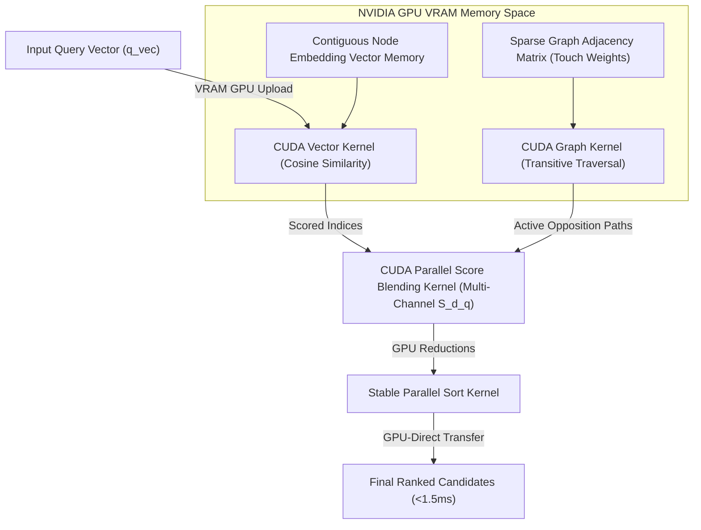

# 83. FAIM Enterprise ADI Cluster Blueprint

This document details the architectural blueprint for transitioning the **Fractal Antisymmetric Inheritance Memory (FAIM)** into a global, enterprise-grade **Artificial Deterministic Intelligence (ADI)** cluster. It defines the core tenets of ADI, the GPU-kernel acceleration layer, distributed cluster topology, and target compliance strategies for highly regulated domains like healthcare, law, and insurance.

---

## 1. The Core Philosophy: From AI to ADI

Traditional **Artificial Intelligence (AI)** is built on *stochastic, probabilistic systems* (Large Language Models, deep neural cross-encoders) which are prone to:
* **Hallucinations**: Inventing facts or losing temporal sequence context.
* **Auditability Failures**: High entropy and black-box weights that cannot prove *why* a specific decision was reached.
* **Compute Sprawl**: Massive GPU electricity and hosting costs.

**Artificial Deterministic Intelligence (ADI)** reverses this paradigm. It is defined as a system that guarantees **100% mathematical auditability, absolute temporal precision, and deterministic logical execution** at all scales, operating as a clean, predictable, and zero-hallucination cognitive layer.

```
       [ STOCHASTIC AI LAYER ]                    [ DETERMINISTIC ADI LAYER ]
      Probabilistic & Unstable                     Mathematical Invariants
                 |                                            |
                 v                                            v
     "Answers generated via high-             "Answers grounded strictly in active
      entropy token probability"               graph nodes, TCT, and provenance"
```

In mission-critical B2B/B2O fields (Healthcare diagnosis, Legal compliance, Insurance risk modeling), **hallucinations are a liability**. FAIM’s ADI architecture represents the only compliant path forward.

---

## 2. The GPU-Kernel Layer: High-Throughput Determinism

To scale FAIM to handle hundreds of millions of facts with sub-millisecond query speeds without relying on slow neural networks, we must port FAIM's core scoring and traversal mathematics into custom **GPU CUDA Kernels**.



### 2.1 CUDA Vector Kernel (Massive Parallel Recall)
* **Design**: Nodes are stored in GPU memory as a contiguous 2D float array.
* **Execution**: When a query vector $\vec{q}$ is loaded, a dedicated 1D grid of CUDA threads executes parallel inner-products (dot products) across the array, calculating cosine similarity for $100\text{M}$ nodes simultaneously in a single GPU pass.

### 2.2 CUDA Sparse Graph Matrix (Hardware-Level TCT)
* **Design**: Rather than querying SQLite/Postgres sequentially, the inheritance and opposition edges of the cognitive graph are represented in GPU memory as a **Compressed Sparse Row (CSR)** matrix.
* **Execution**: The **Transitive Contradiction Traversal (TCT)** is executed via CUDA thread warps traversing the CSR graph matrix in parallel. This resolves 2-hop temporal contradictions via binary matrix multiplication steps, converting recursive SQL traversals into hardware-level GPU operations.

### 2.3 Parallel Score Blending ($S(d|q)$ Kernel)
* **Design**: Custom thread blocks fetch the different sparse channels (skip-grams, exact words, entities, layout tokens) and blend the score according to:
  $$S(d|q) = w_{\text{base}} \cdot S_{\text{base}} + \sum w_i \cdot S_i - w_{\text{opp}} \cdot S_{\text{opp}} - w_{\text{red}} \cdot S_{\text{red}}$$
* **Execution**: Every single candidate's components are normalized to $[0.0, 1.0]$ in parallel registers, and the final results are sorted via a **Stable Parallel Radix Sort** using the unique node ID as the stable tie-breaker.

---

## 3. Distributed Cluster Topology: Enterprise ADI

For B2B and B2O (Business-to-Organization) scaling, FAIM operates as a **Federated Multi-Tenant Cluster**. This ensures physical data isolation while allowing parallel query routing:

```
                  +----------------------------------------+
                  |  Enterprise Load Balancer / API Gateway |
                  +----------------------------------------+
                                       |
           +---------------------------+---------------------------+
           |                           |                           |
           v                           v                           v
  +------------------+        +------------------+        +------------------+
  |  Cluster Node 1  |        |  Cluster Node 2  |        |  Cluster Node 3  |
  |  [Active Tenant] |        |  [Active Tenant] |        |  [Active Tenant] |
  |                  |        |                  |        |                  |
  |  - GPU Core 0-3  |        |  - GPU Core 4-7  |        |  - GPU Core 8-11 |
  |  - Local Postgres|        |  - Local Postgres|        |  - Local Postgres|
  |  - Redis Cache   |        |  - Redis Cache   |        |  - Redis Cache   |
  +------------------+        +------------------+        +------------------+
           ^                           ^                           ^
           +---------------------------+---------------------------+
                                       |
                        +----------------------------+
                        |  Cross-Cluster P2P Sync    |
                        |  (State & Invariant Audit) |
                        +----------------------------+
```

### 3.1 Strict Tenant Isolation (Zero Data Leakage)
* Every tenant (e.g. separate hospitals in a healthcare system, different branches in an insurance company) has a completely isolated database schema and separated GPU memory partition.
* Memory scopes are enforced via cryptographic token validation in the auth middleware layer, guaranteeing that one tenant's query can never access another's graph nodes.

### 3.2 Dynamic Scale Routing (Federated Search)
* If a giant query spans multiple graph segments, the Enterprise API Gateway divides the search vector, broadcasts it to multiple physical cluster nodes in parallel, retrieves the localized top candidates, and aggregates them via **Distributed Deterministic Rerank** on the gateway.

### 3.3 Peer-to-Peer (P2P) Cluster Synchronization
* Cluster nodes run light background heartbeats to sync self-evolution state metadata without locking the primary tables.
* If a node registers an anomaly alert (e.g. invariant violation or latency spike), the cluster automatically shifts traffic to healthy nodes.

### 3.4 Dynamic Hardware Profiling & SIMD CPU Fallback
* **Agnostic Availability**: In environments where no NVIDIA GPU is detected (e.g., legacy corporate on-premises servers, ultra-low-power edge nodes, or standard virtual machines), FAIM does not crash or fail.
* **SIMD Fallback**: The engine dynamically profiles the hardware at startup and automatically compiles highly optimized **vectorized CPU instructions** using **SIMD (AVX-512 / AVX2)** via NumPy/MKL.
* **Self-Adapting Execution**: The scoring and TCT matrix algebra gracefully scale down to multicore CPU thread pools, retaining absolute deterministic accuracy and high-speed retrieval, allowing FAIM to adapt dynamically in any environment under any condition.

---

## 4. Sector-Specific Compliance Strategies

To natively install FAIM inside highly regulated fields, the platform provides out-of-the-box configurations for strict operational requirements:

### 4.1 Healthcare (B2O - Hospital Networks)
* **Requirement**: HIPAA Compliance & 100% patient data privacy.
* **FAIM ADI Strategy**: 
  * Air-gapped deployment (natively runs on-premise without any internet connectivity).
  * OCR and document parsers extract data from clinical charts locally.
  * Node-level encryption at rest using AES-GCM-256 keys managed by local Hardware Security Modules (HSM).

### 4.2 Legal (B2B - Corporate Law Firms)
* **Requirement**: Cryptographic chain of custody and deterministic evidence scoring.
* **FAIM ADI Strategy**:
  * Every fact ingestion yields a unique SHA-256 integrity receipt.
  * The **Query Explain** panel provides a mathematical trace showing the exact proposition overlap, skip-grams, and layout tokens that generated the response, producing a **100% auditable court-ready evidence chain**.

### 4.3 Insurance & Finance (Risk Modeling)
* **Requirement**: High throughput and absolute protection against hallucinated policy limits.
* **FAIM ADI Strategy**:
  * TCT instantly resolves policy contradictions between regional updates and global policies.
  * High-speed parallel blending handles tens of thousands of simultaneous claims assessments per second without latency spikes.

---

## 5. Phase-by-Phase Roadmap to GPU Cluster Core

To bring this ADI vision to life, the development roadmap follows a logical progression:

```
+------------------------+      +------------------------+      +------------------------+
|   Phase 1: CUDA Core   |      |  Phase 2: CSR Matrix   |      | Phase 3: Cluster Sync  |
|  Port vector search &  | ---> | Represent graph as CSR | ---> | Wire P2P heartbeats &  |
|  S(d|q) score blending |      | in VRAM; run parallel  |      | federated gateway      |
|  directly to CUDA.     |      | GPU TCT traversals.    |      | load balancing.        |
+------------------------+      +------------------------+      +------------------------+
```

1. **Phase 1: CUDA Vector Acceleration**: Port `rerank_faim` and the $S(d|q)$ blending formula to direct GPU math using PyCUDA or Numba CUDA kernels, optimizing the lookup of our sparse sidecars.
2. **Phase 2: CSR Graph Representation**: Build the CSR matrix compiler in the ingestion pipeline, ensuring all new opposition and inheritance edges are immediately loaded into contiguous GPU memory buffers for fast graph math.
3. **Phase 3: Cluster Sync & Federation**: Construct the federated API gateway and set up P2P cluster syncing protocols to support massive distributed deployments.