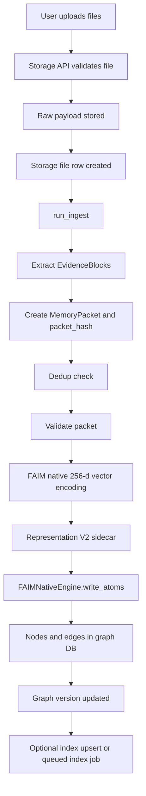
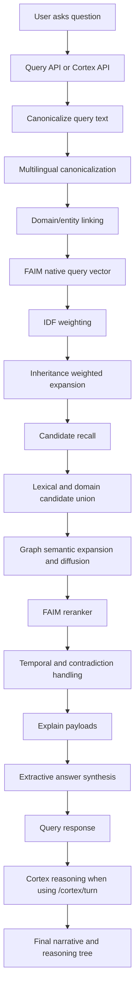

# 69B - FAIM End-to-End Retrieval and Cortex Workflow Guide

## Plain-English Summary

FAIM is not one retrieval method. It is a layered memory system.

The easiest way to understand it:

- upload builds the memory graph
- query searches that memory graph
- rerank chooses the strongest evidence
- Cortex turns evidence into a structured answer
- hops are only the deep graph-walking part
- Cortex thinking is on by default from the backend; users do not need a manual `THINK` button

So vector search is not the whole system. Hops are not the whole system either. They are both parts of a longer road.

## The Two Main Roads

FAIM has two big roads:

1. **Upload road**

User uploads files. FAIM converts them into raw storage records, evidence blocks, vectors, graph nodes, sidecars, and optional index acceleration.

2. **Query road**

User asks a question. FAIM normalizes the text, creates a native query vector, finds candidate memory nodes, expands graph context, reranks evidence, synthesizes an answer, and runs Cortex reasoning in Cortex chat.

In Cortex chat, the reasoning layer is no longer optional from the user's point of view. FAIM runs the enhanced planner, adaptive hop budget, graph traversal branch, and structured reasoning state by default.

## Road 1: Upload to Memory Graph



### What Happens During Upload

| Step | Real code path | What it means |
|---|---|---|
| Upload request | `faim_native/api/routers/storage.py:create_upload_batch` | Receives files, validates size/type, stores raw file bytes, creates upload job/events. |
| Raw storage | `storage.py:_store_raw_upload` | Keeps the original file payload separately from graph nodes. |
| Ingest entry | `faim_native/orchestration/ingest_flow.py:run_ingest` | Main upload-to-graph pipeline. |
| Extraction | `perception.router.route_extraction` | Converts file bytes into EvidenceBlocks. OCR/table/layout extraction can contribute here when available. |
| Packetization | `perception.packetize.create_packet` | Creates a deterministic MemoryPacket and packet hash. |
| Dedup | `IngestDedupModel.check_exists` | Prevents the same packet from creating duplicate graph nodes. |
| Encoding | `encoding.vectorize_blocks` | Creates FAIM native 256-dimensional vectors. This is FAIM-native embedding-style math, not external ML embeddings. |
| Representation sidecar | `encoding.representation_v2.build_representation_v2_for_block` | Adds lexical/phrase/entity style searchable side data. |
| Graph write | `core.engine.FAIMNativeEngine.write_atoms` | Writes nodes, edges, graph version, and merge information. |
| Index acceleration | `index.qdrant_index.FAIMIndex` or worker job | Optional acceleration layer. Canonical truth remains the graph DB. |

## Upload Road in Human Terms

Example:

You upload `payment_policy.pdf`.

FAIM does not just store the PDF. It breaks the file into meaningful evidence blocks, hashes the packet, creates FAIM-native vectors, stores graph nodes, adds metadata/provenance, and updates the graph version.

Later, when you ask:

> What changed in payment retry rules?

FAIM is not searching the PDF directly. It is searching the graph memory built from that PDF.

## Road 2: User Query to Final Output



### What Happens During Query

| Layer | Real code path | What it does |
|---|---|---|
| API entry | `api/routers/query.py`, `api/routers/memory.py`, `api/routers/cortex.py` | Different endpoints, same core retrieval engine. Cortex adds reasoning on top. |
| Core query engine | `orchestration/query_flow.py:run_query` | Main retrieval pipeline. |
| Canonical text | `lexical.canonicalizer` | Converts known aliases/synonyms to graph-local canonical terms. |
| Multilingual text | `lexical.multilingual_canonicalizer` | Maps supported multilingual terms into canonical query form. |
| Domain memory | `core.operators.entity_linking` | Links query terms to learned domain lexicon and graph nodes. |
| Query vector | `encoding.text_vectorizer.vectorize_text` | Builds the FAIM-native query vector. |
| IDF weighting | `core.query.idf_cache` | Adjusts term importance based on graph statistics. |
| Base recall | `recall_with_graph_expansion` or Phase 5 artifacts | Finds initial candidate nodes using vectors/indexes/fallback recall. |
| Lexical retrieval | `RepresentationRepo.top_k_lexical` | Adds candidates that match words/phrases/representation sidecars. |
| Domain retrieval | `build_domain_candidate_scores` | Adds graph nodes linked to learned domain concepts. |
| Graph expansion | `core.query.graph_semantics.build_graph_semantic_scores` | Follows graph edges for related, inherited, semantic, and contradiction-aware context. |
| Rerank | `core.query.query_engine.rerank_faim` | Combines vector, graph, lexical, modality, domain, temporal, and reranker-v2 signals. |
| Answer synthesis | `core.query.answer_synthesis.synthesize_answer` | Builds direct answer, citations, quotes, confidence, and contradiction notes. |

## Where Hops Fit

Hops are not the whole retrieval system.

A hop means:

> Move from one graph node to another graph node through an edge.

In the normal query road, graph expansion uses hop depth to bring in related evidence.

In Cortex, the planner can choose a deeper hop budget and the traversal branch can walk a bounded path through graph edges.


### What Hops Are For

| Question type | Hop usage |
|---|---|
| Simple fact | Usually shallow. Vector, lexical, and rerank may be enough. |
| Explain why | Needs graph hops to find causes and supporting relations. |
| Trace impact | Needs deeper hops through dependency/causal chains. |
| Timeline | Uses graph and temporal signals to connect ordered evidence. |
| Contradiction | Uses graph/opposition signals to keep conflicts visible. |

## Cortex Road: Retrieval Plus Structured Reasoning

Normal query returns search results and a synthesized answer.

Cortex does more:

```mermaid
flowchart TD
    A[User asks in chat] --> B[/api/v1/cortex/turn]
    B --> C[Initial enhanced planner]
    C --> D[Planner sets graph hop options]
    D --> E[run_query retrieves evidence]
    E --> F[Answer packet]
    F --> G[Final planner with confidence]
    G --> H[Parallel reasoning branches]
    H --> I[Traversal branch executes bounded path]
    I --> J[Reducer builds brain_state]
    J --> K[Persist Cortex turn]
    K --> L[Return narrative, answer, reasoning_tree]
    L --> M[FIG View highlights exact path if available]
```

The legacy `think_enabled` request field remains accepted for older clients, but the backend treats Cortex thinking as active by default. The UI should show reasoning status and reasoning summaries, not a manual on/off control.

### Cortex Branches

| Branch | Purpose |
|---|---|
| recall | Finds the direct grounded evidence span. |
| traversal | Runs real bounded graph path traversal using the planned hop budget. |
| timeline | Looks for temporal/current vs historical structure. |
| contradiction | Surfaces conflict notes instead of hiding them. |
| concept | Names recurring concepts from supporting spans. |
| prediction | Suggests what remains stable or uncertain. |
| provenance | Shows where the answer came from. |
| continuity | Carries recent session context forward. |

## Vector Search vs FAIM Vector vs Rerank vs Hops

This is the part that usually gets mentally tangled.

| Thing | What it is | Why it exists |
|---|---|---|
| FAIM native vector | Deterministic 256-dimensional representation of text/block/query. | Gives FAIM a mathematical way to compare memory nodes and questions. |
| Vector recall | First-pass candidate finder. | Quickly finds likely relevant nodes. |
| Lexical retrieval | Word/phrase/entity sidecar matching. | Catches exact language and phrase-level evidence that vectors may soften. |
| Domain retrieval | Learned domain term/entity/fact matching. | Helps niche terms and specialized vocabulary. |
| Graph expansion | Adds connected nodes around good candidates. | Pulls context that is related but not textually identical. |
| Hops | Depth of graph walking. | Controls how far FAIM follows graph relationships. |
| Reranker | Final scoring blend. | Decides which candidates are strongest overall. |
| Cortex | Structured reasoning layer. | Turns evidence into a narrative answer, branches, state, and visual path. |

## The Real Connection

The output is not produced by one thing.

It is produced by this chain:

```text
uploaded data
-> evidence blocks
-> packet hash
-> FAIM vectors
-> graph nodes and edges
-> sidecars and indexes
-> query vector
-> candidate recall
-> graph/domain/lexical expansion
-> FAIM rerank
-> answer synthesis
-> Cortex reasoning
-> final user-facing answer
```

## What Was Before vs What Is Now

| Area | Before | Now |
|---|---|---|
| Upload | Real graph memory build existed. | Still real, with workerized storage upload support and sidecar/index paths. |
| Query | Real vector, graph expansion, rerank, and answer synthesis existed. | Still the base retrieval road. |
| Hops | Some shallow graph expansion existed. Cortex hop claim was stronger than runtime. | Cortex now has planner-driven `1..24` bounded hop runtime and exact traversal branch. |
| UI graph path | Mostly approximate from evidence/reasoning nodes. | Prefers exact traversal path when Cortex returns one. |
| Cortex thinking | User-facing toggle could disable the enhanced path. | Backend always runs enhanced Cortex reasoning; the UI shows status instead of an on/off button. |
| Cortex | Structured reasoning wrapper existed. | Now also influences retrieval depth and emits traversal path metadata. |

## Example End to End

### Upload

User uploads:

> `payment_policy.pdf`

FAIM creates:

- raw file record
- evidence blocks
- packet hash
- FAIM vectors
- graph nodes
- provenance anchors
- representation sidecars
- optional index acceleration

### Query

User asks:

> Why did payment retry behavior change for EU customers?

FAIM does:

- canonicalizes terms like `EU`, `payment retry`, `customers`
- creates FAIM query vector
- recalls likely payment policy nodes
- links domain terms if learned
- expands graph context through related policy nodes
- scores graph, lexical, vector, domain, modality, temporal signals
- reranks strongest evidence
- synthesizes direct answer with citations

### Cortex

If the chat uses Cortex:

- planner sees this is a `why / change / impact` style question
- assigns deeper hop budget
- query retrieval receives deeper graph options
- traversal branch walks graph edges from evidence nodes
- reasoning tree includes recall, traversal, timeline, contradiction, provenance, etc.
- FIG View can highlight exact path nodes/edges if returned

## What To Remember

FAIM retrieval is not only vector search.

It is:

- vector math for candidate discovery
- lexical/domain memory for exact and specialized language
- graph expansion for connected context
- hops for depth
- reranking for final evidence quality
- Cortex for structured reasoning and answer state

The clean mental model:

```text
Vector finds the door.
Graph expansion opens nearby rooms.
Hops decide how far FAIM walks.
Reranker chooses the best evidence.
Cortex explains the answer.
```

## Important Production Boundary

More hops are not always better.

Deep traversal is useful for causal, dependency, timeline, and investigation questions. For simple questions, too many hops can add noise and cost. That is why Cortex uses adaptive hop budgets instead of always forcing `24` hops.

The best retrieval is not “maximum depth”.

The best retrieval is:

- enough depth
- bounded branching
- deterministic scoring
- strong reranking
- grounded citations
- visible reasoning state
