# FAIM-Native: ALL Files Usage Guide

**NONE of these files are dead code!** This document explains **EVERY file** and **WHEN it is used**.

---

## Legend

| Symbol | Meaning |
|:---|:---|
| 🔵 | Used in INGEST flow (user uploads file) |
| 🟢 | Used in QUERY flow (user searches) |
| 🟡 | Used in EVOLVE flow (system thinks/learns) |
| 🔴 | Used in AUTH flow (user logs in) |
| ⚙️ | Infrastructure (always running) |
| 🧪 | Used in tests |

---

## api/ — HTTP API Layer

| File | Used When | Called By |
|:---|:---|:---|
| `app.py` | ⚙️ **Server starts** | Docker container, Gunicorn |
| `deps.py` | ⚙️ **Every API request** | All routers |

### api/middleware/

| File | Used When | Called By |
|:---|:---|:---|
| `auth.py` | ⚙️ **Every API request** | app.py middleware stack |
| `jwt.py` | ⚙️ **Every API request** | app.py middleware stack |
| `ratelimit.py` | ⚙️ **Every API request** | app.py middleware stack |
| `request_id.py` | ⚙️ **Every API request** | app.py middleware stack |
| `security.py` | ⚙️ **Every API request** | app.py middleware stack |
| `session.py` | 🔴 **Session cookie auth** | Optional session flow |
| `errors.py` | ⚙️ **When errors occur** | app.py exception handlers |

### api/routers/

| File | Used When | Called By |
|:---|:---|:---|
| `auth.py` | 🔴 **User logs in** | Frontend login page |
| `ingest.py` | 🔵 **User uploads file** | Frontend upload UI |
| `query.py` | 🟢 **User searches** | Frontend search UI |
| `evolve.py` | 🟡 **System evolution** | Background jobs, Admin API |
| `events.py` | 🔵🟢🟡 **SSE streaming** | Frontend for live updates |
| `node.py` | 🟢 **View nodes** | Frontend graph view |
| `metrics.py` | 🟡 **View diagnostics** | Admin/monitoring |
| `health.py` | ⚙️ **Health checks** | Docker, Kubernetes |
| `admin.py` | ⚙️ **Admin operations** | Admin CLI/API |

### api/validators/

| File | Used When | Called By |
|:---|:---|:---|
| `input_limits.py` | 🔵 **Ingest validation** | routers/ingest.py |

---

## cache/ — Caching Layer (Redis)

| File | Used When | Called By |
|:---|:---|:---|
| `locks.py` | 🟡 **Evolve lock** | orchestration/evolve_flow.py |
| `query_cache.py` | 🟢 **Query caching** | runtime/context.py |
| `redis_client.py` | ⚙️ **Redis connection** | All cache operations |

**Proof:** `orchestration/evolve_flow.py` line 168: `from cache.locks import evolve_lock`

---

## core/ — FAIM Engine

| File | Used When | Called By |
|:---|:---|:---|
| `antisym.py` | 🔵 **Merge detection** | core/engine_native.py |
| `engine.py` | 🔵 **Engine interface** | orchestration/ingest_flow.py |
| `engine_native.py` | 🔵 **Write atoms** | orchestration/ingest_flow.py |
| `invariants.py` | 🟡 **Invariant checks** | tests, evolution logic |

**Proof:** `tests/unit/test_fractal_physics_determinism.py` line 213: `from core.invariants import check_scaling_bounds`

### core/contracts/

| File | Used When | Called By |
|:---|:---|:---|
| `types.py` | ⚙️ **Type definitions** | All core files |

### core/dynamics/

| File | Used When | Called By |
|:---|:---|:---|
| `evolution_native.py` | 🟡 **Evolution cycle** | orchestration/evolve_flow.py |
| `invention_native.py` | 🟡 **Macro creation** | orchestration/evolve_flow.py |
| `nativegraph.py` | 🟡 **Graph hash** | Engine operations |

**Proof:** `orchestration/evolve_flow.py` line 204: `from core.dynamics.evolution_native import evolve_once`

### core/metrics/

| File | Used When | Called By |
|:---|:---|:---|
| `fractal_physics.py` | 🟡 **Physics calculations** | evolution_native.py, invention_native.py |
| `metrics_defs.py` | 🟡 **Metric definitions** | All metric operations |

**Proof:** `core/dynamics/evolution_native.py` line 47: `from core.metrics.fractal_physics import ...`

### core/operators/

| File | Used When | Called By |
|:---|:---|:---|
| `inheritance.py` | 🔵 **Parent selection** | core/engine_native.py |
| `prune.py` | 🟡 **Prune weak nodes** | core/dynamics/evolution_native.py |

**Proof:** `core/dynamics/evolution_native.py` line 53: `from core.operators.prune import PrunePolicy, can_prune`

### core/query/

| File | Used When | Called By |
|:---|:---|:---|
| `query_engine.py` | 🟢 **Search execution** | orchestration/query_flow.py |

---

## encoding/ — Vector Encoding

| File | Used When | Called By |
|:---|:---|:---|
| `text_vectorizer.py` | 🔵 **Text → vectors** | orchestration/ingest_flow.py |
| `vector_schema.py` | 🔵 **Vector format** | All encoding operations |

### encoding/OCR/

| File | Used When | Called By |
|:---|:---|:---|
| `ocr_features.py` | 🔵 **PDF/Image OCR** | perception/router.py (for PDFs) |

### encoding/adapters/

| File | Used When | Called By |
|:---|:---|:---|
| `audio_adapter.py` | 🔵 **Audio files** | perception/router.py (for audio) |

### encoding/layout/

| File | Used When | Called By |
|:---|:---|:---|
| `layout_features.py` | 🔵 **Document layout** | perception/router.py (for docs) |

---

## index/ — Vector Index (Qdrant)

| File | Used When | Called By |
|:---|:---|:---|
| `qdrant_collections.py` | 🔵🟢 **Collection management** | qdrant_index.py |
| `qdrant_index.py` | 🔵🟢 **Vector search** | ingest_flow.py, query_flow.py |

**Proof:** `orchestration/ingest_flow.py` line 394: `from index.qdrant_index import FAIMIndex`

---

## orchestration/ — Business Logic Flows

| File | Used When | Called By |
|:---|:---|:---|
| `ingest_flow.py` | 🔵 **User uploads** | routers/ingest.py |
| `query_flow.py` | 🟢 **User searches** | routers/query.py |
| `evolve_flow.py` | 🟡 **System evolution** | routers/evolve.py, background jobs |

### orchestration/jobs/

| File | Used When | Called By |
|:---|:---|:---|
| `backup.py` | ⚙️ **Backup operations** | worker.py, admin API |
| `job_store.py` | ⚙️ **Job persistence** | worker.py |
| `worker.py` | ⚙️ **Background worker** | Docker worker container |

**Proof:** Docker Compose has `faim-worker` service that runs these jobs!

### orchestration/perf/

| File | Used When | Called By |
|:---|:---|:---|
| `gpu_backend.py` | 🔵 **GPU acceleration** | FAST profile mode |
| `hot_cache.py` | 🟢 **Hot data caching** | Query acceleration |
| `ingest_worker.py` | 🔵 **Parallel ingest** | FAST profile mode |
| `nvme_snapshot.py` | ⚙️ **NVMe snapshots** | Backup operations |
| `spec.py` | ⚙️ **Speed profiles** | All flows (STRICT/FAST) |
| `telemetry.py` | ⚙️ **Performance metrics** | Monitoring |
| `vector_bank.py` | 🔵 **Vector batching** | High-throughput ingest |
| `write_queue.py` | 🔵 **Write batching** | High-throughput ingest |

**Proof:** `tests/acceptance/test_AT_O5_spec_dimension.py` line 32: `from orchestration.perf.spec import SPEED_PROFILES`

---

## perception/ — Input Processing

| File | Used When | Called By |
|:---|:---|:---|
| `packetize.py` | 🔵 **Create packet** | orchestration/ingest_flow.py |
| `router.py` | 🔵 **Route by type** | orchestration/ingest_flow.py |
| `validate.py` | 🔵 **Validate input** | orchestration/ingest_flow.py |

### perception/extract/

| File | Used When | Called By |
|:---|:---|:---|
| `extractors_faim.py` | 🔵 **Extract text** | perception/router.py |

**Proof:** `perception/router.py` line 141: `from perception.extract.extractors_faim import ...`

---

## runtime/ — Configuration

| File | Used When | Called By |
|:---|:---|:---|
| `config.py` | ⚙️ **Server starts** | app.py, all modules |
| `context.py` | ⚙️ **Every request** | deps.py |
| `logging.py` | ⚙️ **All logging** | All modules |
| `secrets.py` | ⚙️ **Secret loading** | Auth, crypto |

---

## store/ — Persistence Layer

### store/crypto/

| File | Used When | Called By |
|:---|:---|:---|
| `envelope.py` | 🔵 **Encrypt payloads** | raw storage, sensitive data |

**Proof:** `store/crypto/__init__.py` line 3: `from store.crypto.envelope import ...`

### store/journal/

| File | Used When | Called By |
|:---|:---|:---|
| `event_journal.py` | 🔵🟢🟡 **Event logging** | query_flow.py, all operations |

**Proof:** `orchestration/query_flow.py` line 38: `from store.journal.event_journal import EventJournal`

### store/pg/

| File | Used When | Called By |
|:---|:---|:---|
| `graph_store.py` | 🔵🟢🟡 **High-level graph ops** | All flows |
| `migrate.py` | ⚙️ **Database migrations** | Server startup, CLI |
| `models_auth.py` | 🔴 **Auth models** | auth_repo.py |
| `models_crypto.py` | 🔵 **Crypto models** | Encrypted storage |
| `models_faim.py` | 🔵🟢🟡 **Core models** | All repos |
| `schema.sql` | ⚙️ **Schema definition** | migrate.py |
| `session.py` | ⚙️ **DB connection** | All DB operations |

### store/pg/repos/

| File | Used When | Called By |
|:---|:---|:---|
| `auth_repo.py` | 🔴 **Auth data** | routers/auth.py, admin |
| `edge_repo.py` | 🔵🟡 **Edge operations** | engine_native.py |
| `event_repo.py` | 🔵🟢🟡 **Event logging** | All flows |
| `graph_version_repo.py` | 🔵🟡 **Version bumps** | engine_native.py |
| `node_repo.py` | 🔵🟢🟡 **Node operations** | engine_native.py, query |
| `packet_repo.py` | 🔵 **Packet storage** | ingest operations |
| `payload_store.py` | 🔵 **Payload storage** | Large data storage |
| `raw_repo.py` | 🔵 **Raw file refs** | ingest_flow.py |
| `snapshot_repo.py` | 🟡 **Snapshots** | evolve_flow.py |

**Proof:** `tests/conftest.py` line 25: `from store.raw.raw_store import RawStore`

### store/raw/

| File | Used When | Called By |
|:---|:---|:---|
| `crypto.py` | 🔵 **Payload encryption** | encrypted_payload_store.py |
| `encrypted_payload_store.py` | 🔵 **Encrypted payloads** | Secure ingest |
| `raw_store.py` | 🔵 **Raw file storage** | ingest operations |

**Proof:** `store/raw/encrypted_payload_store.py` line 17-18 imports both crypto and raw_store

---

## scripts/ — Utility Scripts

| File | Used When | Called By |
|:---|:---|:---|
| `encode_atoms.py` | 🧪 **Demo/testing** | Manual testing |
| `event_append_demo.py` | 🧪 **Demo** | Manual testing |
| `extract_packet.py` | 🧪 **Demo** | Manual testing |
| `faim_diagnostics_demo.py` | 🧪 **Demo** | Manual testing |
| `faim_write_demo.py` | 🧪 **Demo** | Manual testing |
| `packet_validate.py` | 🧪 **Demo** | Manual testing |
| `raw_ingest.py` | 🧪 **CLI ingest** | Admin CLI |
| `raw_verify.py` | 🧪 **Verification** | Admin CLI |
| `snapshot_create_demo.py` | 🧪 **Demo** | Manual testing |

---

## Summary: When Each Module is Used

```
USER ACTION          → MODULES USED
─────────────────────────────────────────────────
🔴 Login             → auth.py, jwt.py, auth_repo.py, models_auth.py
🔵 Upload File       → ingest_flow.py → perception/* → encoding/* → engine_native.py → repos/*
🟢 Search            → query_flow.py → query_engine.py → index/* → node_repo.py
🟡 Evolution         → evolve_flow.py → dynamics/* → operators/* → metrics/* → repos/*
⚙️ Server Running    → app.py, middleware/*, runtime/*, session.py
```

---

## Visual: ALL Flows Together

```mermaid
flowchart TB
    subgraph AUTH["🔴 Auth Flow"]
        A1[routers/auth.py]
        A2[middleware/jwt.py]
        A3[repos/auth_repo.py]
        A4[models_auth.py]
        A1 --> A3 --> A4
    end

    subgraph INGEST["🔵 Ingest Flow"]
        I1[routers/ingest.py]
        I2[ingest_flow.py]
        I3[perception/router.py]
        I4[extract/extractors_faim.py]
        I5[packetize.py]
        I6[validate.py]
        I7[text_vectorizer.py]
        I8[engine_native.py]
        I9[inheritance.py]
        I10[antisym.py]
        I11[node_repo.py]
        I12[edge_repo.py]
        I13[event_repo.py]
        I14[index/qdrant_index.py]
        I15[raw_store.py]
        I16[payload_store.py]
        
        I1 --> I2
        I2 --> I3 --> I4
        I3 --> I5 --> I6
        I6 --> I7
        I7 --> I8
        I8 --> I9
        I8 --> I10
        I8 --> I11 --> I12 --> I13
        I2 --> I14
        I2 --> I15 --> I16
    end

    subgraph QUERY["🟢 Query Flow"]
        Q1[routers/query.py]
        Q2[query_flow.py]
        Q3[query_engine.py]
        Q4[qdrant_index.py]
        Q5[event_journal.py]
        Q6[query_cache.py]
        
        Q1 --> Q2 --> Q3
        Q3 --> Q4
        Q2 --> Q5
        Q2 --> Q6
    end

    subgraph EVOLVE["🟡 Evolution Flow"]
        E1[routers/evolve.py]
        E2[evolve_flow.py]
        E3[cache/locks.py]
        E4[evolution_native.py]
        E5[invention_native.py]
        E6[prune.py]
        E7[fractal_physics.py]
        E8[metrics_defs.py]
        E9[invariants.py]
        E10[snapshot_repo.py]
        
        E1 --> E2
        E2 --> E3
        E2 --> E4 --> E6
        E2 --> E5
        E4 --> E7 --> E8
        E4 --> E9
        E2 --> E10
    end

    subgraph INFRA["⚙️ Infrastructure"]
        IF1[app.py]
        IF2[middleware/*]
        IF3[session.py]
        IF4[migrate.py]
        IF5[config.py]
        IF6[logging.py]
        IF7[worker.py]
        IF8[backup.py]
        
        IF1 --> IF2
        IF1 --> IF3
        IF4 --> IF3
    end

    DB[(PostgreSQL)]
    REDIS[(Redis)]
    QDRANT[(Qdrant)]

    INGEST --> DB
    QUERY --> DB
    EVOLVE --> DB
    INGEST --> QDRANT
    QUERY --> QDRANT
    EVOLVE --> REDIS
    QUERY --> REDIS
```



---

## Conclusion

**EVERY file has a purpose!**

- Some files run on **every request** (middleware, session)
- Some files run during **ingest** (perception, encoding, engine)
- Some files run during **query** (query_engine, index)
- Some files run during **evolution** (dynamics, operators, metrics)
- Some files are **infrastructure** (migrations, config, logging)
- Some files are for **testing/demos** (scripts/)

**NO FILE IS DEAD CODE!**
