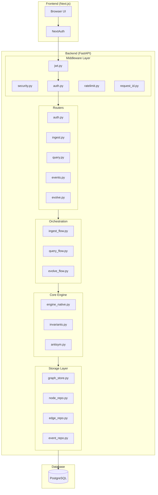
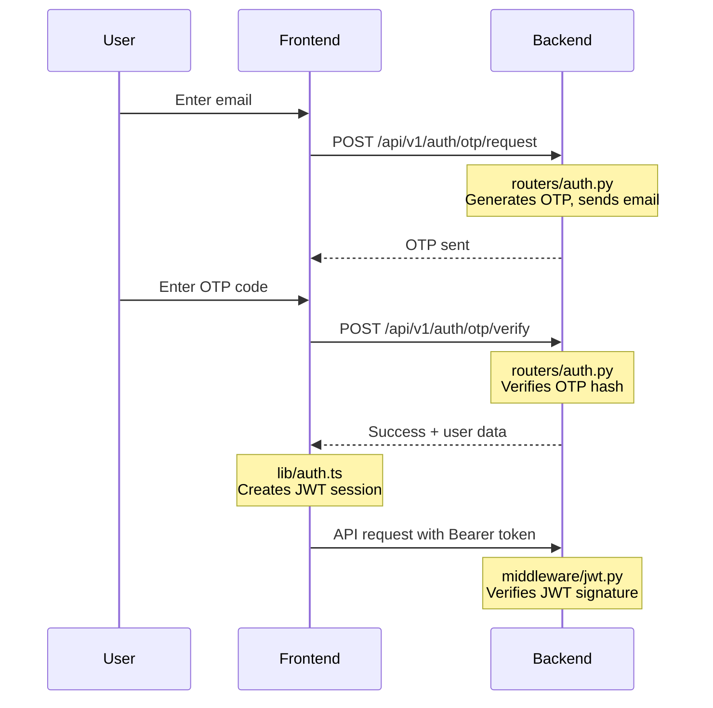
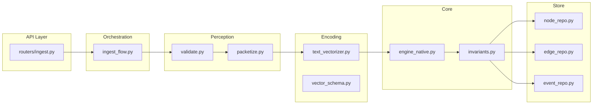
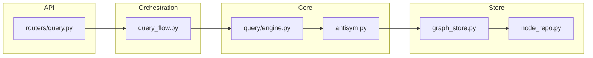
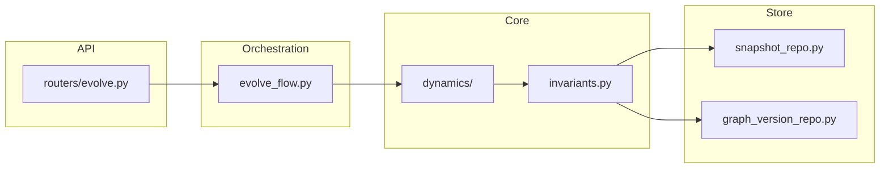
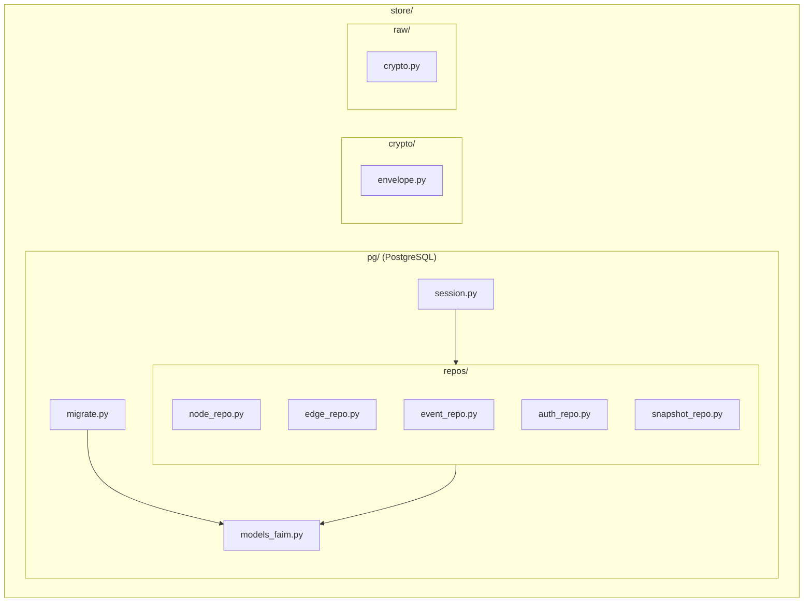

# FAIM-Native Backend Architecture

This document provides a **complete file-by-file breakdown** of how the FAIM-Native backend works, from user entry to data storage.

---

## High-Level Architecture



---

## Request Lifecycle: Step-by-Step

### Phase 1: Entry Point

| Step | File                                                         | Purpose                                                               |
| :--- | :----------------------------------------------------------- | :-------------------------------------------------------------------- |
| 1    | [app.py](file:///home/sephi-asi/FAIM/faim_native/api/app.py) | FastAPI application factory, middleware registration, router mounting |

### Phase 2: Middleware Stack (Executed in Order)

| Order | File                                                                                  | Purpose                                            |
| :---- | :------------------------------------------------------------------------------------ | :------------------------------------------------- |
| 1     | [security.py](file:///home/sephi-asi/FAIM/faim_native/api/middleware/security.py)     | Adds security headers (HSTS, CSP, X-Frame-Options) |
| 2     | [jwt.py](file:///home/sephi-asi/FAIM/faim_native/api/middleware/jwt.py)               | Verifies NextAuth JWT tokens (Bearer auth)         |
| 3     | [auth.py](file:///home/sephi-asi/FAIM/faim_native/api/middleware/auth.py)             | Validates API keys, sets `tenant_id`               |
| 4     | [ratelimit.py](file:///home/sephi-asi/FAIM/faim_native/api/middleware/ratelimit.py)   | Token bucket rate limiting per tenant              |
| 5     | [request_id.py](file:///home/sephi-asi/FAIM/faim_native/api/middleware/request_id.py) | Generates unique request ID for tracing            |

---

## User Authentication Flow



**Key Files:**
| File | Role |
|:---|:---|
| [routers/auth.py](file:///home/sephi-asi/FAIM/faim_native/api/routers/auth.py) | OTP request/verify endpoints |
| [middleware/jwt.py](file:///home/sephi-asi/FAIM/faim_native/api/middleware/jwt.py) | JWT token verification |
| [middleware/auth.py](file:///home/sephi-asi/FAIM/faim_native/api/middleware/auth.py) | API key fallback auth |

---

## Data Ingestion Flow



**File-by-File Breakdown:**

| Step | File                                                                                      | What Happens                             |
| :--- | :---------------------------------------------------------------------------------------- | :--------------------------------------- |
| 1    | [routers/ingest.py](file:///home/sephi-asi/FAIM/faim_native/api/routers/ingest.py)        | Receives raw data from client            |
| 2    | [ingest_flow.py](file:///home/sephi-asi/FAIM/faim_native/orchestration/ingest_flow.py)    | Orchestrates the full ingestion pipeline |
| 3    | [validate.py](file:///home/sephi-asi/FAIM/faim_native/perception/validate.py)             | Validates input structure and content    |
| 4    | [packetize.py](file:///home/sephi-asi/FAIM/faim_native/perception/packetize.py)           | Splits data into FAIM packets            |
| 5    | [text_vectorizer.py](file:///home/sephi-asi/FAIM/faim_native/encoding/text_vectorizer.py) | Generates vector embeddings              |
| 6    | [vector_schema.py](file:///home/sephi-asi/FAIM/faim_native/encoding/vector_schema.py)     | Defines FAIM vector structure            |
| 7    | [engine_native.py](file:///home/sephi-asi/FAIM/faim_native/core/engine_native.py)         | Core FAIM engine operations              |
| 8    | [invariants.py](file:///home/sephi-asi/FAIM/faim_native/core/invariants.py)               | Validates FAIM invariants (Σf=1)         |
| 9    | [node_repo.py](file:///home/sephi-asi/FAIM/faim_native/store/pg/repos/node_repo.py)       | Persists nodes to PostgreSQL             |
| 10   | [edge_repo.py](file:///home/sephi-asi/FAIM/faim_native/store/pg/repos/edge_repo.py)       | Persists edges to PostgreSQL             |
| 11   | [event_repo.py](file:///home/sephi-asi/FAIM/faim_native/store/pg/repos/event_repo.py)     | Logs to append-only event journal        |

---

## Query Flow



**Key Files:**
| File | Role |
|:---|:---|
| [routers/query.py](file:///home/sephi-asi/FAIM/faim_native/api/routers/query.py) | Query endpoint (semantic search) |
| [query_flow.py](file:///home/sephi-asi/FAIM/faim_native/orchestration/query_flow.py) | Orchestrates query processing |
| [antisym.py](file:///home/sephi-asi/FAIM/faim_native/core/antisym.py) | Antisymmetric opposition logic |
| [graph_store.py](file:///home/sephi-asi/FAIM/faim_native/store/pg/graph_store.py) | High-level graph operations |

---

## Evolution Flow (Memory Metabolism)



**Key Files:**
| File | Role |
|:---|:---|
| [routers/evolve.py](file:///home/sephi-asi/FAIM/faim_native/api/routers/evolve.py) | Triggers evolution cycle |
| [evolve_flow.py](file:///home/sephi-asi/FAIM/faim_native/orchestration/evolve_flow.py) | Orchestrates evolution |
| [snapshot_repo.py](file:///home/sephi-asi/FAIM/faim_native/store/pg/repos/snapshot_repo.py) | Stores graph snapshots |

---

## Storage Layer Architecture



**File-by-File:**
| File | Purpose |
|:---|:---|
| [session.py](file:///home/sephi-asi/FAIM/faim_native/store/pg/session.py) | SQLAlchemy session factory |
| [migrate.py](file:///home/sephi-asi/FAIM/faim_native/store/pg/migrate.py) | Database migration runner |
| [models_faim.py](file:///home/sephi-asi/FAIM/faim_native/store/pg/models_faim.py) | SQLAlchemy ORM models |
| [schema.sql](file:///home/sephi-asi/FAIM/faim_native/store/pg/schema.sql) | Raw SQL schema definition |

---

## Runtime Configuration

| File                                                                     | Purpose                            |
| :----------------------------------------------------------------------- | :--------------------------------- |
| [config.py](file:///home/sephi-asi/FAIM/faim_native/runtime/config.py)   | Environment config loading         |
| [context.py](file:///home/sephi-asi/FAIM/faim_native/runtime/context.py) | Request context and repo injection |
| [logging.py](file:///home/sephi-asi/FAIM/faim_native/runtime/logging.py) | JSON logging with secret redaction |
| [secrets.py](file:///home/sephi-asi/FAIM/faim_native/runtime/secrets.py) | Secure secret management           |

---

## Complete File Tree

```
faim_native/
├── api/                          # HTTP API Layer
│   ├── app.py                    # FastAPI app factory
│   ├── deps.py                   # Dependency injection
│   ├── middleware/
│   │   ├── auth.py               # API key auth
│   │   ├── jwt.py                # JWT auth (NextAuth)
│   │   ├── ratelimit.py          # Rate limiting
│   │   ├── request_id.py         # Request tracing
│   │   ├── security.py           # Security headers
│   │   └── session.py            # Session cookies
│   ├── routers/
│   │   ├── auth.py               # OTP login
│   │   ├── ingest.py             # Data ingestion
│   │   ├── query.py              # Semantic search
│   │   ├── events.py             # Event streaming (SSE)
│   │   ├── evolve.py             # Evolution triggers
│   │   ├── node.py               # Node CRUD
│   │   ├── metrics.py            # Observability
│   │   ├── health.py             # Health checks
│   │   └── admin.py              # Admin operations
│   └── validators/               # Input validation
│
├── orchestration/                # Business Logic Flows
│   ├── ingest_flow.py            # Ingestion pipeline
│   ├── query_flow.py             # Query pipeline
│   ├── evolve_flow.py            # Evolution cycle
│   └── jobs/                     # Background workers
│
├── core/                         # FAIM Engine
│   ├── engine_native.py          # Core operations
│   ├── invariants.py             # FAIM invariants
│   ├── antisym.py                # Opposition logic
│   ├── dynamics/                 # Evolution dynamics
│   ├── operators/                # Graph operators
│   └── query/                    # Query engine
│
├── encoding/                     # Vector Encoding
│   ├── text_vectorizer.py        # Text → Vector
│   └── vector_schema.py          # FAIM vector format
│
├── perception/                   # Input Processing
│   ├── validate.py               # Input validation
│   ├── packetize.py              # Data chunking
│   └── router.py                 # Modality routing
│
├── store/                        # Persistence
│   ├── pg/                       # PostgreSQL
│   │   ├── session.py            # DB sessions
│   │   ├── migrate.py            # Migrations
│   │   ├── models_faim.py        # ORM models
│   │   ├── graph_store.py        # Graph operations
│   │   └── repos/                # Data access
│   │       ├── node_repo.py
│   │       ├── edge_repo.py
│   │       ├── event_repo.py
│   │       ├── auth_repo.py
│   │       └── snapshot_repo.py
│   ├── crypto/                   # Encryption
│   └── raw/                      # Raw file storage
│
├── runtime/                      # Configuration
│   ├── config.py                 # Env config
│   ├── context.py                # Request context
│   ├── logging.py                # JSON logging
│   └── secrets.py                # Secret management
│
├── cache/                        # Caching (Redis)
└── index/                        # Vector index (Qdrant)
```

---

## Summary

When a user enters FAIM:

1. **Frontend** → NextAuth creates JWT session
2. **Backend** → Middleware verifies JWT, sets tenant
3. **Router** → Handles specific endpoint (ingest/query/etc)
4. **Orchestration** → Manages the complete flow
5. **Core** → Executes FAIM-native logic
6. **Store** → Persists to PostgreSQL

All files work together to maintain **tenant isolation**, **data integrity**, and **10/10 security**.
