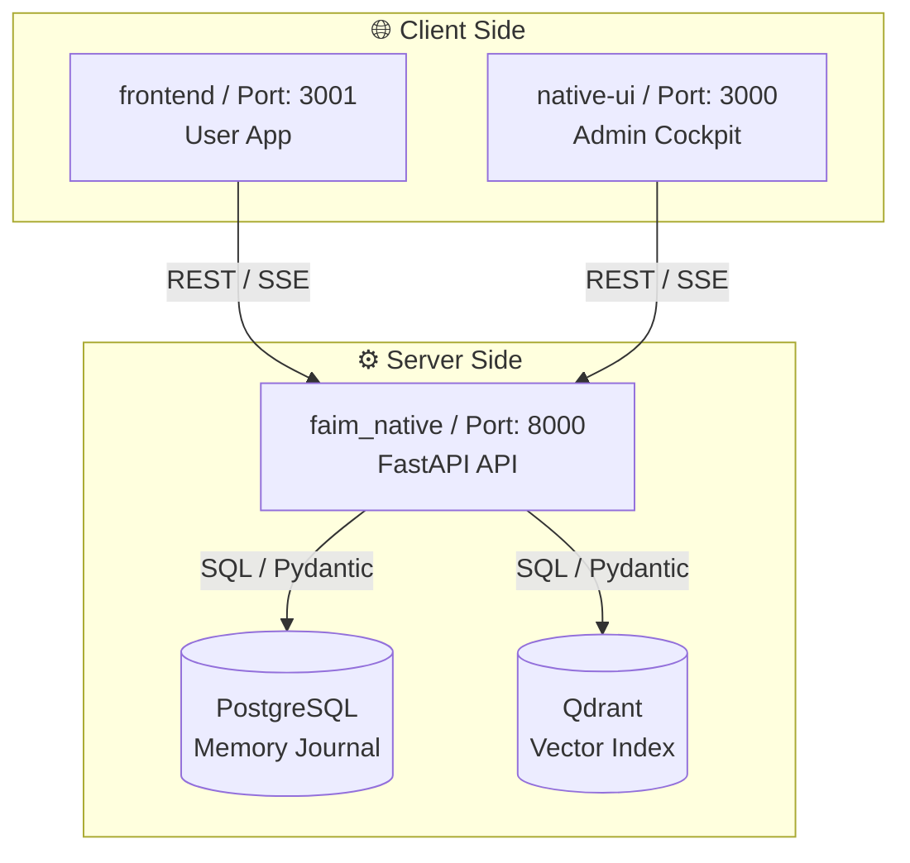

# FAIM Full-Stack Workflow Guide

This document explains **exactly how to work on FAIM** across the entire stack. It covers the Backend (`faim_native`), User Frontend (`frontend`), and Admin Cockpit (`native-ui`).

---

## 1. The Big Picture (Architecture)

FAIM is a distributed system where the frontend and backend work in tandem to maintain a secure, deterministic memory graph.

---

## 2. Backend Development (`faim_native`)

The backend is written in **Python 3.10+** using **FastAPI**.

### 🚀 Key Commands
| Action | Command |
| :--- | :--- |
| **Start Server** | `cd faim_native && python3 api/app.py` |
| **Interactive Docs** | Open `http://localhost:8000/docs` in browser |
| **Run Tests** | `./scripts/verify.sh` |
| **Add Dependencies** | Edit `requirements.txt` in root |

### 📂 Directory Structure
*   **`api/`**: Request handling. Add new endpoints in `api/routers/`.
*   **`core/`**: The internal "brain." Logic for inheritance, physics, and evolution.
*   **`store/`**: Data persistence. `store/pg/` for SQL, `store/raw/` for blobs.
*   **`orchestration/`**: Multi-step workflows (e.g., `ingest_flow.py`).

### 🛠️ How to Add a New Feature
1.  **Define Model**: Add a Pydantic model in your new router file.
2.  **Add Router**: Create a new file in `api/routers/` and register it in `api/app.py`.
3.  **Implement Logic**: Add core logic in `core/` or `orchestration/`.
4.  **Test**: Create a test in `tests/acceptance/` to verify the endpoint.

---

## 3. Frontend Development (`frontend`)

The user app is built with **Next.js 14** (App Router) and **Tailwind CSS**.

### 🚀 Key Commands
| Action | Command |
| :--- | :--- |
| **Start Dev** | `cd frontend && npm run dev -- -p 3001` |
| **Build Web** | `npm run build` |
| **Type Check** | `npm run typecheck` |

### 📂 Directory Structure
*   **`src/app/`**: Routes and page layouts.
*   **`src/components/`**: UI components.
    *   `layout/`: Shell, Nav, TopBar.
    *   `ui/`: Reusable primitives (Buttons, Cards).
*   **`src/lib/`**: Business logic. `api.ts` for backend calls, `auth.ts` for NextAuth.

### 🛠️ How to Add a New Page
1.  **Create Route**: Add a new folder in `src/app/(app)/` with a `page.tsx`.
2.  **Build Components**: Create reusable parts in `src/components/`.
3.  **Fetch Data**: Use the `faimClient` in `lib/api.ts` to talk to the backend.
4.  **Style**: Use Tailwind classes and the Design Tokens in `globals.css`.

---

## 4. Admin Workflow (`native-ui`)

The **Admin Cockpit** is for you, the engineer. It provides tools the regular user doesn't see.

*   **Port**: Always runs on `3000`.
*   **Command**: `cd native-ui && npm run dev`.
*   **When to use**:
    *   Monitoring **Fractal Metrics** ($D, H, \lambda$).
    *   Triggering **Manual Evolution** cycles.
    *   Managing **API Keys** and **Snapshots**.

---

## 5. The 10/10 Security Protocol

FAIM is hard-hardened. You **must** follow these rules for every code change:

1.  **Always Scope by `tenant_id`**: Every database query must have `.filter(tenant_id=...)`.
2.  **Implicit Auth**: Backend routes should use `ctx: FAIMContext = Depends(get_faim_context)`.
3.  **Log Redaction**: Never print `X-Api-Key` or user passwords to the console/logs.
4.  **Idempotency**: Use `packet_hash` for all ingestion to prevent data duplication.

---

## Summary of Ports
*   **3000**: Admin Command Center (`native-ui`)
*   **3001**: User Application (`frontend`)
*   **8000**: Core Backend API (`faim_native`)

*Last Updated: 2026-01-20*
