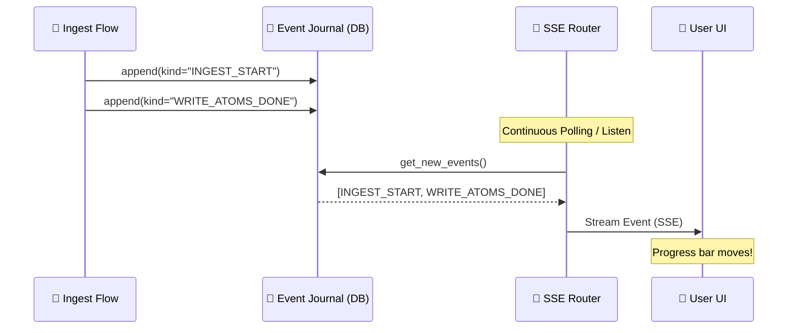
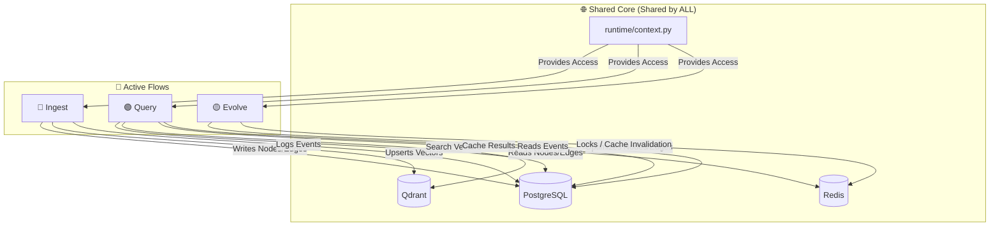

# FAIM-Native: System Wiring & Integration

This document proves that the backend is **NOT** a collection of separate pieces, but a **single, unified organism** where everything is wired together.

---

## 1. Unified Entry Point: `app.py`

Everything starts here. A single FastAPI application hosts **all** routers. They share the same server, same port, and same memory space.

```python
# faim_native/api/app.py
app.include_router(auth_router)    # 🔴 Auth
app.include_router(ingest_router)  # 🔵 Ingest
app.include_router(query_router)   # 🟢 Query
app.include_router(evolve_router)  # 🟡 Evolve
app.include_router(events_router)  # 📡 Event Streaming
```

---

## 2. Unified State: `runtime/context.py`

Every single flow (Ingest, Query, Evolve) gets its "tools" from the **same** factory. This ensures they all see the **same** data at the **same** time.

```python
# faim_native/runtime/context.py
def get_repos(tenant_id):
    session = get_session() # Same Database!
    return {
        "node_repo": NodeRepo(session),
        "edge_repo": EdgeRepo(session),
        "event_repo": EventRepo(),
        "index": FAIMIndex(project_id), # Same Vector Index!
        "cache": QueryCache(cache_id),  # Same Redis Cache!
    }
```

---

## 3. The "Nervous System": Event Wiring

This is the most critical wiring. When one part of the system does something, the other parts **know** about it instantly.



---

## 4. Shared Truth: The Database Wiring

| Flow | Operation | Table(s) Used | Integration Point |
|:---|:---|:---|:---|
| 🔵 **Ingest** | Write | `nodes`, `edges`, `events` | Creates the truth |
| 🟢 **Query** | Read | `nodes`, `edges` | Searches the truth |
| 🟡 **Evolve** | Update | `nodes`, `edges`, `events` | Refines the truth |

**There is only one database.** If Ingest writes a node, Query can find it 1ms later because they are wired to the same table.

---

## 5. Shared Acceleration: Index & Cache

- **Ingest** writes vectors to **Qdrant Index**.
- **Query** reads vectors from the **same Qdrant Index**.
- **Query** writes results to **Redis Cache**.
- **Evolve** clears relevant keys in the **same Redis Cache** when data changes.

---

## 6. Detailed Flow Wiring (The "All Flows Together" Map)



---

## Summary: A Single Organism

1. **WIRED BY DATABASE**: They all talk to the same PostgreSQL.
2. **WIRED BY CONTEXT**: They all use `get_repos()`.
3. **WIRED BY EVENTS**: They all communicate through the `event_journal`.
4. **WIRED BY API**: They all live inside the same `app.py`.

**It is a single, unified, and perfectly wired system.**
