# FAIM-Native: Complete User-to-Database Flow

This document explains **exactly what happens** at each step when a user interacts with FAIM, file-by-file, from user entry to database storage.

---

## Overview Flow

```mermaid
flowchart TD
    USER[👤 User opens FAIM in browser]
    
    subgraph FRONTEND["🌐 Frontend (Next.js)"]
        F1[src/app/page.tsx<br/>Renders login UI]
        F2[src/lib/auth.ts<br/>NextAuth config]
        F3[src/middleware.ts<br/>Adds Bearer token to requests]
    end
    
    subgraph BACKEND["⚙️ Backend (FastAPI)"]
        subgraph MW["Middleware Stack"]
            M1[security.py<br/>Adds security headers]
            M2[jwt.py<br/>Verifies JWT token]
            M3[auth.py<br/>Validates tenant]
            M4[ratelimit.py<br/>Checks rate limits]
            M5[request_id.py<br/>Generates request ID]
        end
        
        R1[routers/ingest.py<br/>Receives file upload]
        
        subgraph ORCH["Orchestration"]
            O1[ingest_flow.py<br/>Runs pipeline]
        end
        
        subgraph PERC["Perception"]
            P1[router.py<br/>Routes by file type]
            P2[validate.py<br/>Validates input]
            P3[packetize.py<br/>Creates packet]
        end
        
        subgraph ENC["Encoding"]
            E1[text_vectorizer.py<br/>Creates vectors]
            E2[vector_schema.py<br/>Defines format]
        end
        
        subgraph CORE["Core Engine"]
            C1[engine_native.py<br/>write_atoms]
            C2[antisym.py<br/>Merge detection]
            C3[inheritance.py<br/>Parent selection]
        end
        
        subgraph STORE["Storage"]
            S1[node_repo.py<br/>Upsert nodes]
            S2[edge_repo.py<br/>Create edges]
            S3[event_repo.py<br/>Log events]
            S4[graph_version_repo.py<br/>Bump version]
        end
    end
    
    DB[(PostgreSQL)]
    
    USER --> F1 --> F2 --> F3
    F3 --> M1 --> M2 --> M3 --> M4 --> M5
    M5 --> R1 --> O1
    O1 --> P1 --> P3 --> P2
    P2 --> E1 --> E2
    E2 --> C1
    C1 --> C3 --> C2
    C2 --> S1 --> S2 --> S3 --> S4
    S4 --> DB
```



---

## STEP 1: User Opens FAIM (Frontend)

### File: `frontend/src/app/page.tsx`
**What happens:** User opens browser, Next.js renders the login page.

### File: `frontend/src/lib/auth.ts`
**What happens:** NextAuth configuration is loaded.

```typescript
// This defines HOW users log in
export const authOptions: NextAuthOptions = {
  providers: [
    CredentialsProvider({
      // When user submits login form:
      async authorize(credentials) {
        // 1. Call backend to verify OTP
        const res = await fetch(`${API_URL}/api/v1/auth/otp/verify`, {
          method: "POST",
          body: JSON.stringify({ email, code }),
        });
        // 2. If successful, return user object
        return { id, email, name, graphId };
      },
    }),
  ],
  callbacks: {
    async jwt({ token, user }) {
      // 3. Create JWT with user info
      token.accessToken = jwt.sign({ sub: user.id, email }, SECRET);
      return token;
    },
  },
};
```

---

## STEP 2: User Logs In (OTP Flow)

### File: `api/routers/auth.py`
**What happens:** Backend receives OTP request and verification.

```python
# POST /api/v1/auth/otp/request
@router.post("/otp/request")
async def request_otp(body: OTPRequestBody):
    # 1. Check rate limit (max 3 per 15 min)
    if not _check_rate_limit(email):
        raise HTTPException(status_code=429)
    
    # 2. Generate secure 6-digit OTP
    code = _generate_otp()  # Uses secrets module
    
    # 3. Store OTP hash (NEVER plaintext!)
    otp_hash = _hash_otp(code, email)
    _OTP_STORE[email_hash] = {"otp_hash": otp_hash, "expiry": ...}
    
    # 4. Send via email (Resend API)
    _send_otp_email(email, code)

# POST /api/v1/auth/otp/verify
@router.post("/otp/verify")
async def verify_otp(body: OTPVerifyBody):
    # 1. Check lockout (5 failed = 30 min lock)
    if _check_lockout(email):
        raise HTTPException(status_code=429)
    
    # 2. Verify OTP hash (constant-time comparison!)
    if not _verify_otp_hash(stored_hash, body.code, email):
        _record_failed_attempt(email)
        return {"success": False}
    
    # 3. Success - return user info
    return {"success": True, "user": {"id": ..., "email": ..., "graph_id": ...}}
```

---

## STEP 3: User Makes API Request (Middleware)

When user makes any API call (e.g., upload file), the request passes through **5 middleware layers** in order:

### File: `api/middleware/security.py` (1st)
**What happens:** Adds security headers to response.
```python
response.headers["Strict-Transport-Security"] = "max-age=31536000"
response.headers["X-Content-Type-Options"] = "nosniff"
response.headers["X-Frame-Options"] = "DENY"
```

### File: `api/middleware/jwt.py` (2nd)
**What happens:** Verifies the JWT token from NextAuth.
```python
# 1. Extract token from "Authorization: Bearer <token>"
token = extract_bearer_token(request)

# 2. Verify signature with NEXTAUTH_SECRET
claims = jwt.decode(token, SECRET, algorithms=["HS256"])

# 3. Set tenant_id for isolation
request.state.tenant_id = f"user:{claims['sub']}"
```

### File: `api/middleware/auth.py` (3rd)
**What happens:** If no JWT, checks API key fallback.
```python
# Get API key from X-Api-Key header
api_key = request.headers.get("X-Api-Key")

# Validate against hashed keys (constant-time!)
if validate_tenant_key(tenant_id, api_key):
    request.state.tenant_id = tenant_id
```

### File: `api/middleware/ratelimit.py` (4th)
**What happens:** Checks rate limits per tenant.
```python
# Check if tenant exceeded limit
if rate_limiter.is_rate_limited(tenant_id):
    return JSONResponse(status_code=429, ...)

# Track this request
rate_limiter.record_request(tenant_id)
```

### File: `api/middleware/request_id.py` (5th)
**What happens:** Generates unique request ID for tracing.
```python
request.state.request_id = str(uuid.uuid4())
```

---

## STEP 4: User Uploads File (Router)

### File: `api/routers/ingest.py`
**What happens:** Receives file upload, calls orchestration.

```python
@router.post("/ingest")
async def ingest_file(
    file: UploadFile,
    ctx: FAIMContext = Depends(get_faim_context),  # From deps.py
):
    # 1. Read file bytes
    file_bytes = await file.read()
    
    # 2. Store raw file first
    raw_id = ctx.raw_repo.store(file_bytes, filename)
    
    # 3. Call ingest flow (the main pipeline!)
    result = run_ingest(
        graph_id=ctx.graph_id,
        raw_id=raw_id,
        filename=filename,
        file_bytes=file_bytes,
        tenant_id=ctx.tenant_id,
        session=ctx.session,
        node_repo=ctx.node_repo,
        edge_repo=ctx.edge_repo,
        event_repo=ctx.event_repo,
    )
    
    return result.to_dict()
```

---

## STEP 5: Ingest Pipeline (Orchestration)

### File: `orchestration/ingest_flow.py`
**What happens:** This is the MAIN PIPELINE. It orchestrates everything.

```python
def run_ingest(graph_id, raw_id, filename, file_bytes, ...):
    
    # STEP 5.1: Extract EvidenceBlocks
    from perception.router import route_extraction
    blocks = route_extraction(file_bytes, filename, raw_id)
    # → Returns list of EvidenceBlock objects
    
    # STEP 5.2: Create MemoryPacket with hash
    from perception.packetize import create_packet
    packet = create_packet(raw_id, blocks)
    packet_hash = packet.packet_hash  # SHA256 - idempotency key!
    
    # STEP 5.3: Check deduplication
    if IngestDedupModel.check_exists(session, tenant_id, graph_id, packet_hash):
        return IngestResult(status="dedup_hit", ...)  # Already processed!
    
    # STEP 5.4: Validate packet + blocks
    from perception.validate import assert_valid
    assert_valid(packet, blocks)
    
    # STEP 5.5: Encode to vectors (256 dimensions)
    from encoding import encode_blocks
    vectors = encode_blocks(blocks)
    # → Returns list of FAIMVector objects
    
    # STEP 5.6: Write to graph via engine
    from core.engine import FAIMNativeEngine
    engine = FAIMNativeEngine(node_repo, edge_repo, event_repo, gv_repo)
    write_result = engine.write_atoms(graph_id, vectors)
    
    # STEP 5.7: Record for future dedup
    IngestDedupModel.record_ingest(session, tenant_id, graph_id, packet_hash, ...)
    
    return IngestResult(
        status="completed",
        nodes_written=write_result.nodes_written,
        merges=write_result.merges,
        ...
    )
```

---

## STEP 6: Perception Layer

### File: `perception/router.py`
**What happens:** Routes file to correct extractor based on type.

```python
def route_extraction(file_bytes, filename, raw_id):
    # 1. Detect file type
    if filename.endswith(".txt"):
        return extract_text(file_bytes, raw_id)
    elif filename.endswith(".pdf"):
        return extract_pdf(file_bytes, raw_id)
    # ... etc
```

### File: `perception/packetize.py`
**What happens:** Creates MemoryPacket with SHA256 hash.

```python
def create_packet(raw_id, blocks):
    # 1. Serialize blocks deterministically
    content = json.dumps([b.to_dict() for b in blocks], sort_keys=True)
    
    # 2. Compute SHA256 hash
    packet_hash = hashlib.sha256(content.encode()).hexdigest()
    
    return MemoryPacket(raw_id=raw_id, blocks=blocks, packet_hash=packet_hash)
```

### File: `perception/validate.py`
**What happens:** Validates packet structure and content.

```python
def assert_valid(packet, blocks):
    # 1. Check blocks not empty
    assert len(blocks) > 0, "No blocks extracted"
    
    # 2. Check each block has required fields
    for block in blocks:
        assert block.text is not None
        assert len(block.text) <= MAX_BLOCK_SIZE
```

---

## STEP 7: Encoding Layer

### File: `encoding/text_vectorizer.py`
**What happens:** Converts text blocks to 256-dimensional vectors.

```python
def encode_blocks(blocks):
    vectors = []
    for block in blocks:
        # 1. Extract features (NO ML! Deterministic only!)
        features = extract_text_features(block.text)
        
        # 2. Create 256-dim vector
        v_native = create_native_vector(features)
        
        # 3. Compute vector hash
        vector_hash = hashlib.sha256(str(v_native).encode()).hexdigest()
        
        vectors.append(FAIMVector(
            block_id=block.block_id,
            v_native=v_native,
            vector_hash=vector_hash,
        ))
    
    return vectors
```

### File: `encoding/vector_schema.py`
**What happens:** Defines the FAIMVector format.

```python
VECTOR_DIMENSION = 256

@dataclass
class FAIMVector:
    block_id: str
    v_native: List[float]  # 256 floats
    vector_hash: str       # SHA256 of vector
```

---

## STEP 8: Core Engine

### File: `core/engine_native.py`
**What happens:** Writes atoms to graph with inheritance and merging.

```python
class FAIMNativeEngine:
    def write_atoms(self, graph_id, vectors):
        result = WriteResult()
        
        for vector in vectors:
            # STEP 8.1: Upsert atom node
            node_id = self.node_repo.upsert_atom_node(graph_id, vector)
            
            # STEP 8.2: Compute inheritance parents
            candidates = self._get_parent_candidates(graph_id, node_id)
            plan = compute_inheritance_plan(vector.v_native, candidates, k=8)
            
            # STEP 8.3: Set inheritance edges
            self.edge_repo.set_inheritance_parents(graph_id, node_id, plan.parents)
            
            # STEP 8.4: Antisym scan for merge candidates
            merge_candidates = self._get_merge_candidates(graph_id, node_id, vector)
            for cand_id, score in merge_candidates:
                if should_merge(score, threshold=0.95):
                    # Merge and create opposition edge
                    self.edge_repo.add_opposition_edge(graph_id, winner, loser, score)
                    result.merges += 1
            
            result.nodes_written += 1
        
        # STEP 8.5: Bump graph version
        result.graph_version = self.graph_version_repo.bump(graph_id)
        
        return result
```

### File: `core/operators/inheritance.py`
**What happens:** Selects parent nodes for inheritance.

```python
def compute_inheritance_plan(child_vector, candidates, k=8):
    # 1. Compute similarity to each candidate
    scores = []
    for parent_id, parent_vector in candidates:
        sim = cosine_similarity(child_vector, parent_vector)
        scores.append((parent_id, sim))
    
    # 2. Select top-k parents
    top_k = sorted(scores, key=lambda x: -x[1])[:k]
    
    # 3. Compute inheritance fractions (must sum to 1!)
    total = sum(s for _, s in top_k)
    fractions = [s / total for _, s in top_k]
    
    return InheritancePlan(parents=[p for p, _ in top_k], fractions=fractions)
```

### File: `core/antisym.py`
**What happens:** Detects and merges opposing nodes.

```python
def opposition_score(vec_a, vec_b):
    # Compute how "opposite" two vectors are
    return 1.0 - cosine_similarity(vec_a, vec_b)

def should_merge(score, threshold=0.95):
    return score >= threshold

def merge_vectors(a_id, b_id, a_hash, b_hash, score):
    # Deterministically pick winner (by hash for consistency)
    if a_hash < b_hash:
        return MergeResult(winner_id=a_id, loser_id=b_id)
    else:
        return MergeResult(winner_id=b_id, loser_id=a_id)
```

---

## STEP 9: Storage Layer (Database)

### File: `store/pg/repos/node_repo.py`
**What happens:** Upserts nodes to PostgreSQL.

```python
class NodeRepo:
    def upsert_atom_node(self, graph_id, vector):
        # 1. Check if node exists (by vector_hash)
        existing = self.session.query(NodeModel).filter(
            NodeModel.tenant_id == self.tenant_id,
            NodeModel.graph_id == graph_id,
            NodeModel.vector_hash == vector.vector_hash,
        ).first()
        
        if existing:
            return existing.node_id  # Idempotent!
        
        # 2. Create new node
        node = NodeModel(
            tenant_id=self.tenant_id,
            graph_id=graph_id,
            vector_hash=vector.vector_hash,
            v_native=vector.v_native,
            level=0,  # Atom level
        )
        self.session.add(node)
        self.session.flush()
        
        return node.node_id
```

### File: `store/pg/repos/edge_repo.py`
**What happens:** Creates inheritance and opposition edges.

```python
class EdgeRepo:
    def set_inheritance_parents(self, graph_id, child_id, parents_with_fractions):
        edge_ids = []
        for parent_id, fraction in parents_with_fractions:
            edge = EdgeModel(
                tenant_id=self.tenant_id,
                graph_id=graph_id,
                src_node_id=parent_id,
                dst_node_id=child_id,
                kind="inheritance",
                weight=int(fraction * 1e9),  # Store as integer
            )
            self.session.add(edge)
            edge_ids.append(edge.edge_id)
        return edge_ids
```

### File: `store/pg/repos/event_repo.py`
**What happens:** Logs events to append-only journal.

```python
class EventRepo:
    def append(self, graph_id, kind, payload):
        event = EventModel(
            tenant_id=self.tenant_id,
            graph_id=graph_id,
            kind=kind,
            payload=json.dumps(payload),
            created_at=datetime.utcnow(),
        )
        self.session.add(event)
        # Note: Events are APPEND-ONLY (no update/delete allowed!)
```

### File: `store/pg/repos/graph_version_repo.py`
**What happens:** Bumps graph version after writes.

```python
class GraphVersionRepo:
    def bump(self, graph_id, reason=""):
        # Atomic increment
        current = self.get(graph_id) or 0
        new_version = current + 1
        
        self.session.execute(
            update(GraphVersionModel)
            .where(GraphVersionModel.graph_id == graph_id)
            .values(version=new_version)
        )
        
        return new_version
```

---

## STEP 10: Response to User

The response flows back:
1. `node_repo` → returns `node_id`
2. `engine_native.py` → returns `WriteResult`
3. `ingest_flow.py` → returns `IngestResult`
4. `routers/ingest.py` → returns JSON response
5. Frontend receives response and updates UI

---

## Summary: Complete File Path

| Step | File | Action |
|:---|:---|:---|
| 1 | `frontend/src/lib/auth.ts` | User logs in with OTP |
| 2 | `api/routers/auth.py` | Verify OTP, return JWT |
| 3 | `frontend/src/middleware.ts` | Add Bearer token to requests |
| 4 | `api/middleware/jwt.py` | Verify JWT signature |
| 5 | `api/middleware/auth.py` | Set tenant_id |
| 6 | `api/routers/ingest.py` | Receive file upload |
| 7 | `orchestration/ingest_flow.py` | Run full pipeline |
| 8 | `perception/router.py` | Route by file type |
| 9 | `perception/packetize.py` | Create packet with hash |
| 10 | `perception/validate.py` | Validate input |
| 11 | `encoding/text_vectorizer.py` | Create 256-dim vectors |
| 12 | `core/engine_native.py` | Write atoms |
| 13 | `core/operators/inheritance.py` | Select parents |
| 14 | `core/antisym.py` | Merge detection |
| 15 | `store/pg/repos/node_repo.py` | Upsert nodes |
| 16 | `store/pg/repos/edge_repo.py` | Create edges |
| 17 | `store/pg/repos/event_repo.py` | Log events |
| 18 | `store/pg/repos/graph_version_repo.py` | Bump version |
| 19 | **PostgreSQL** | Data persisted! |

---

## Evolution Flow (When System "Thinks")

### File: `orchestration/evolve_flow.py`
**When:** Called periodically or on demand.

```python
def run_evolve(graph_id, ...):
    # 1. Acquire distributed lock
    from cache.locks import evolve_lock
    with evolve_lock(graph_id):
        
        # 2. Run evolution cycle
        from core.dynamics.evolution_native import evolve_once
        result = evolve_once(graph_id, node_repo, edge_repo)
        
        # 3. Check for invention
        from core.dynamics.invention_native import should_invent, invent_macro
        if should_invent(graph_id):
            invent_macro(graph_id, node_repo, edge_repo)
        
        # 4. Compute diagnostics
        from core.metrics.fractal_physics import compute_diagnostics
        diagnostics = compute_diagnostics(graph_id)
        
        # 5. Save snapshot
        snapshot_repo.save(graph_id, diagnostics)
```

### File: `core/dynamics/evolution_native.py`
**What happens:** Prunes weak nodes, strengthens strong ones.

```python
def evolve_once(graph_id, node_repo, edge_repo):
    # 1. Get prune policy
    from core.operators.prune import PrunePolicy, can_prune
    
    # 2. Find weak nodes
    nodes = node_repo.list_nodes(graph_id)
    for node in nodes:
        if can_prune(node, policy=PrunePolicy.WEAK):
            node_repo.mark_pruned(node.node_id)
    
    # 3. Recompute metrics
    from core.metrics.fractal_physics import recompute_all
    recompute_all(graph_id)
```

---

## Query Flow (When User Searches)

### File: `api/routers/query.py`
**What happens:** Receives search query.

### File: `orchestration/query_flow.py`
**What happens:** Runs semantic search.

```python
def run_query(graph_id, query_text, ...):
    # 1. Encode query to vector
    query_vector = encode_text(query_text)
    
    # 2. Search graph
    from core.query.query_engine import search
    results = search(graph_id, query_vector, k=10)
    
    # 3. Apply antisym filtering
    from core.antisym import filter_opposition
    filtered = filter_opposition(results)
    
    return filtered
```

---

**This is exactly how FAIM works, file-by-file, from user to database!**
